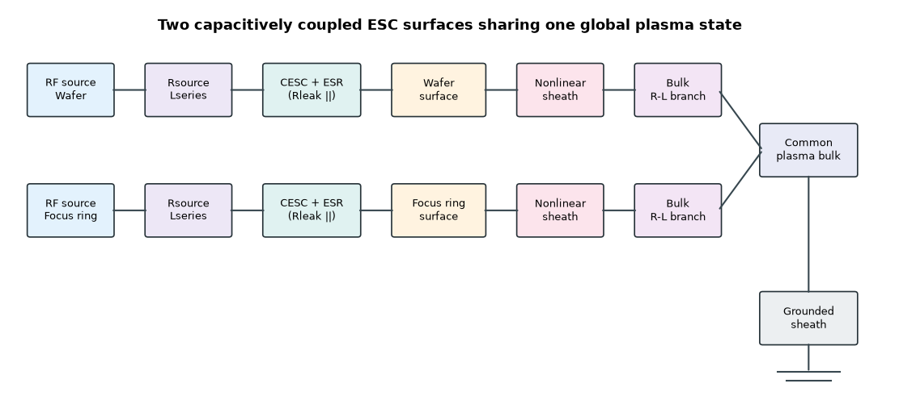
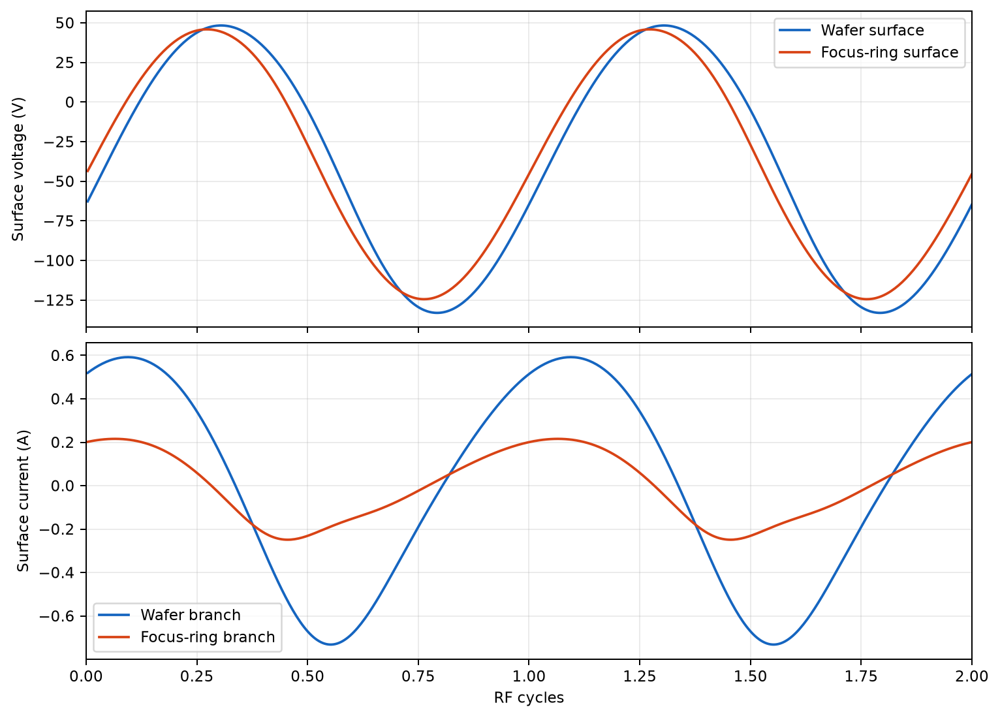
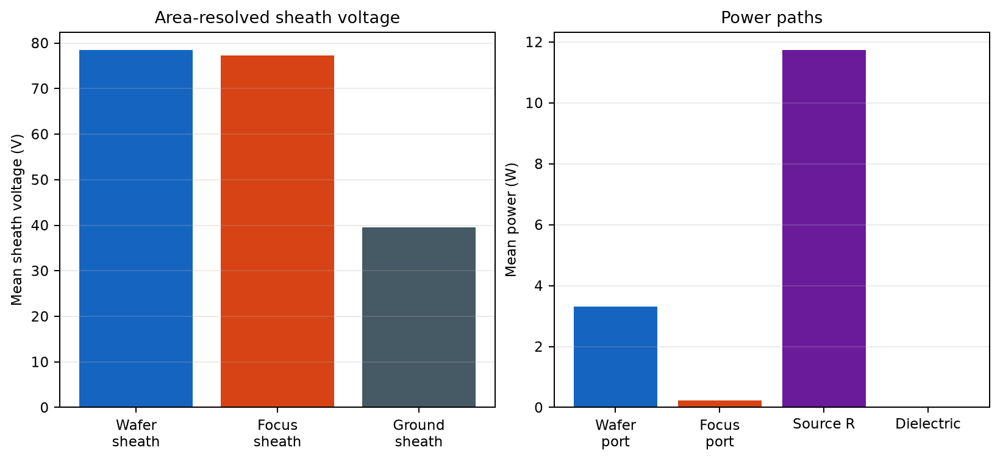
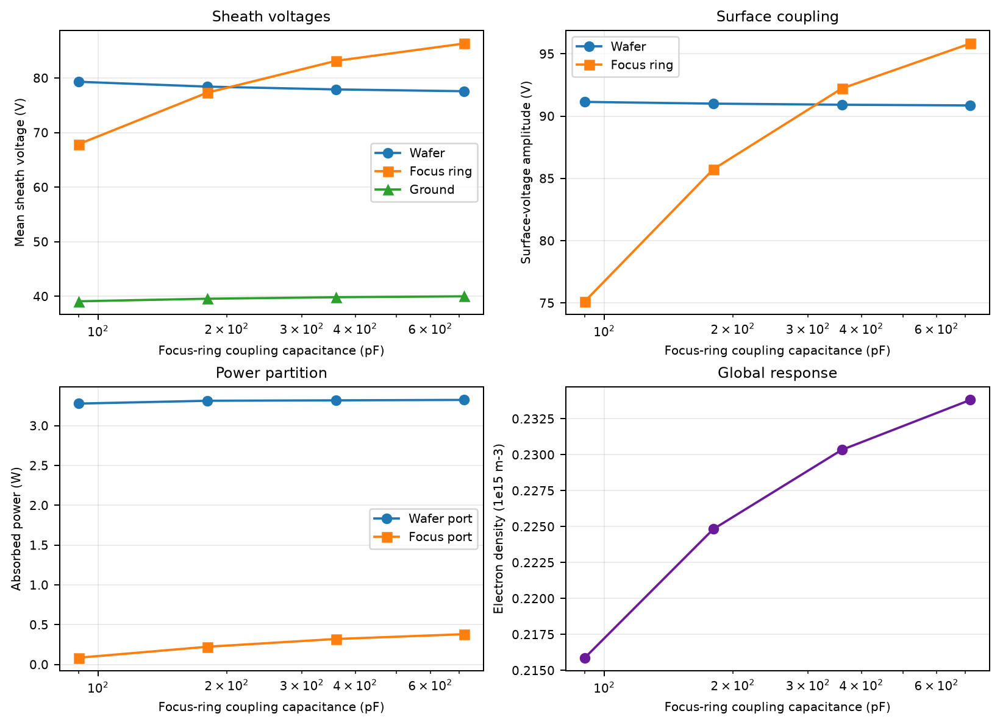

# Wafer―Focus Ring二表面ESCプラズマ等価回路モデル

作成日: 2026-09-02

## 1. 結論

静電チャック上のWafer面とFocus-ring面を、異なる誘電体容量を介して独立電極へ接続し、共通のプラズマへ結合するngspiceモデルを開発した。各表面は独立した非線形シースとプラズマバルク枝を持ち、電子温度・電子密度は三表面を含む0Dグローバル粒子・電力収支から自己無撞着に計算する。

- シース容量は物理的な行列シース微分容量 `alpha_C=0.5` を標準とした。
- Wafer、Focus ring、接地壁の平均シース電圧を別々に電力収支へ入れた。
- 各埋込み電極の電圧振幅・位相・出力抵抗・直列インダクタンスを独立設定できる。
- 各ESC結合枝に容量、誘電損失ESR、DCリークを持たせた。
- 代表条件は密度反復18回で収束し、全系電力収支残差は`0.0268%`だった。
- Focus-ring容量4水準の感度計算は全点収束し、容量低下によりring上シース電圧とring側吸収電力が低下する傾向を再現した。

Focus ringと下部構造の直列容量がWafer側より小さく、ringの充電とシース電圧を左右するという構造は、Wangらの計算研究で報告されている。[Wang et al. (2021)](https://www.osti.gov/pages/biblio/1980702) また、誘電体で覆われた電極が受ける電流は変位電流であることも、産業用CCPの数値研究で明示されている。[Physics of Plasmas 31, 033508 (2024)](https://pubs.aip.org/aip/pop/article/31/3/033508/3279954/Voltage-waveform-tailoring-for-high-aspect-ratio)

## 2. 実装した回路



Wafer枝とFocus-ring枝は次の順に接続する。

```text
RF source
  -> source resistance
  -> series inductance
  -> ESC dielectric capacitance + ESR + leakage
  -> plasma-facing surface
  -> nonlinear matrix sheath
  -> area-scaled plasma bulk R-L branch
  -> common plasma bulk
  -> grounded-wall sheath
  -> ground
```

二つの電源は独立なので、単一駆動、同相二重駆動、位相差駆動、片側終端を同じモデルで表現できる。代表計算では、容量差だけの効果を見やすくするため、両電極を同じ`100 V peak`、同相で駆動した。

## 3. 物理モデル

### 3.1 ESC誘電体

各表面の結合容量は入力パラメータとし、幾何から見積もる場合は

```text
C_ESC = epsilon_0 epsilon_r A / d
ESR = tan(delta) / (omega C_ESC)
```

を使う。代表値のWafer側`2.8 nF`は、300 mm Wafer、`epsilon_r≈9`、有効厚さ約`2 mm`に相当する。Focus-ring側`180 pF`は、外径約350 mmのring面積、`epsilon_r≈4`、有効厚さ約`5 mm`に相当する。実機では、接触ギャップ、He層、ring下部部材、電極被覆を直列容量へ含めて同定する必要がある。

純容量型ESCでWaferと電極が容量結合し、有限な体積抵抗・接触抵抗を持つことは、ESCの基礎研究とも整合する。[Microelectronic Engineering 73–74 (2004)](https://www.sciencedirect.com/science/article/pii/S0167931704002485)

### 3.2 三つのシース

Wafer、Focus ring、接地壁の各面積を`A_j`とし、

```text
K_j = 2 e n_e epsilon_0 A_j^2
Q_j(V_s) = sqrt(K_j V_s)
C_s,j = dQ_j/dV_s = 0.5 sqrt(K_j/V_s)
```

を使う。`V_s=0`近傍は既存モデルと同じ滑らかな絶対値で有限化する。

```text
C_s,j,reg = 0.5 sqrt(K_j / sqrt(V_s,j^2 + delta_C^2))
```

電子電流は滑らかな正部分を障壁へ使い、負のシース電圧でも飽和電流を超えない。

### 3.3 面積分割したプラズマバルク

WaferとFocus-ringの各枝に

```text
L_p,j = l_p m_e / (e^2 n_e A_j)
R_p,j = nu_eff L_p,j
```

を置き、共通プラズマバルクノードで合流させる。同相で同じ電圧が加わる極限では、並列枝の実効インダクタンスが合計面積に対応する。

### 3.4 多表面グローバルモデル

粒子収支はプラズマ体積`V_p`と総損失面積を使う。

```text
V_p n_g K_iz(T_e) = u_B(T_e) (A_w + A_f + A_g)
```

電力収支では、三つの平均シース電圧を面積重み付きで加える。

```text
E_pair = E_collision + 2 T_e
       + sum_j [A_j/A_total * (mean(V_s,j) + T_e/2)]

n_e = P_abs / (V_p n_g K_iz E_pair e)
```

元のSchmidt二表面モデルは、この一般式でFocus-ring面をWafer面へ統合した場合に一致する。[Schmidt et al. (2018)](https://arxiv.org/html/1804.05638v1)

## 4. 代表条件

以下は装置校正値ではなく、モデルの動作確認用仮定である。

| 項目 | Wafer | Focus ring |
|---|---:|---:|
| 表面積 | `0.07069 m^2` | `0.02553 m^2` |
| 電源 | `100 V peak` | `100 V peak` |
| 位相 | `0 deg` | `0 deg` |
| 電源抵抗 | `50 ohm` | `50 ohm` |
| 直列インダクタンス | `50 nH` | `50 nH` |
| ESC結合容量 | `2.8 nF` | `180 pF` |
| 誘電損失正接 | `0.002` | `0.002` |

共通条件はAr、`2 Pa`、`300 K`、`13.56 MHz`、プラズマ体積`2.886e-3 m^3`、接地損失面積`0.2 m^2`とした。RF電源は10周期の`tanh`包絡で滑らかに立ち上げ、最後の20周期だけを解析した。

## 5. 代表計算結果

| 量 | 結果 |
|---|---:|
| 電子温度 | `3.9774 eV` |
| 電子密度 | `2.2486e14 m^-3` |
| 合計プラズマ吸収電力 | `3.5333 W` |
| Wafer / Focus-ring側吸収電力 | `3.3109 / 0.2224 W` |
| Wafer / Focus-ring平均シース | `78.43 / 77.32 V` |
| 接地壁平均シース | `39.56 V` |
| Wafer / Focus-ring表面振幅 | `91.00 / 85.74 V` |
| Wafer / Focus-ring DC電位 | `-38.87 / -37.76 V` |
| Wafer / Focus-ring基本波電流 | `0.6422 / 0.2199 A` |
| Wafer / Focus-ring電流THD | `0.128 / 0.186` |
| 電源供給電力 | `15.2719 W` |
| 電源抵抗損失 | `11.7295 W` |
| 誘電体損失 | `0.0050 W` |
| 電力収支残差 | `0.0268%` |



Focus-ring側は小さなESC容量によって電流振幅が抑えられ、Wafer側より大きな電流THDを持つ。表面電圧には位相差も現れており、単一の合成電極では表現できない枝間相互作用を捉えている。



この代表回路には整合器を入れていないため、50 ohm電源抵抗の損失が支配的である。これはモデル不良ではなく、未整合の基準回路として意図した結果である。実装の次段階では各電極の外部整合回路を追加する。

## 6. Focus-ring容量感度

両電極の電圧と位相を固定し、Focus-ring結合容量のみを変更した。

| `C_focus` (pF) | `n_e` (`1e15 m^-3`) | Focus表面振幅 (V) | Focus平均シース (V) | Focus吸収電力 (W) | 合計吸収電力 (W) |
|---:|---:|---:|---:|---:|---:|
| `90` | `0.2159` | `75.14` | `67.89` | `0.0857` | `3.3633` |
| `180` | `0.2248` | `85.75` | `77.32` | `0.2230` | `3.5360` |
| `360` | `0.2303` | `92.23` | `83.14` | `0.3206` | `3.6388` |
| `720` | `0.2338` | `95.84` | `86.33` | `0.3811` | `3.7049` |



容量を小さくするとFocus-ring表面のRF振幅、平均シース電圧、吸収電力が一貫して低下した。Wafer側の吸収電力は約`3.3 W`でほぼ一定だが、全吸収電力の変化を通じて電子密度も変化する。4条件すべてで収束し、最大電力収支残差は`0.0585%`、最大周期L2差は`7.31e-5`だった。

## 7. 実行方法

```powershell
uv sync
uv run plasma-esc `
  --config configs/esc_wafer_focus_ring.json `
  --output artifacts/esc_wafer_focus_ring/baseline

uv run plasma-esc-sweep `
  --sweep configs/esc_focus_capacitance_sweep.json `
  --raw-output artifacts/esc_wafer_focus_ring/focus_capacitance_sweep
```

集計値は [esc_wafer_focus_ring.json](data/esc_wafer_focus_ring.json) と [esc_focus_capacitance_sweep.json](data/esc_focus_capacitance_sweep.json) に保存する。各密度反復のnetlist、ngspiceログ、波形は`artifacts/`へ保存する。

## 8. 限界

1. 0Dモデルなので、Wafer端とFocus-ring境界の半径方向シース曲率、電界レンズ、イオン入射角分布を直接計算しない。
2. Waferとringで共通の電子温度・密度を仮定し、局所プラズマ密度差を持たない。
3. イオンエネルギー分布、二次電子放出、表面反応、ring侵食は未実装である。
4. 代表容量・面積・電源回路は仮定値であり、実機のVNA、LCR、電圧電流プローブ測定で置換する必要がある。
5. 二つの50 ohm電源を直接接続した未整合回路であり、実機の整合器・フィルタ・ケーブル相互結合は次段階で追加する。

## 9. 次の開発

1. Wafer/Focus-ring電源の振幅比・位相差マップを計算し、シース電圧差を最小化する条件を探索する。
2. 各電極へL型またはπ型整合器を追加し、相互インピーダンスを含む二入力整合問題として解く。
3. 実機のESC層構成から容量行列`C_ww, C_ff, C_wf`を作り、電極間相互容量を追加する。
4. 実測した複素電圧・電流、自己バイアス、位相からESC容量・寄生抵抗・バルクパラメータを同定する。
