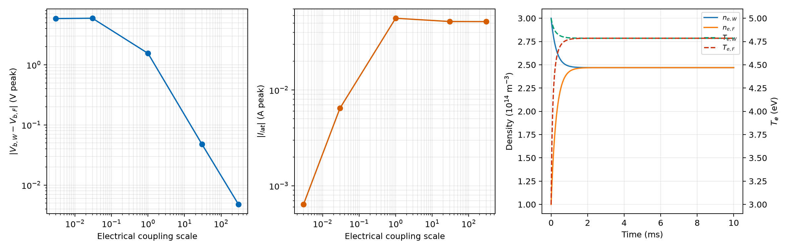

# Wafer―Focus Ring 二ゾーン・プラズマ等価回路の段階検証

## 1. 目的

Wafer 上のプラズマと Focus ring 上のプラズマを二つのグローバル領域に分けたとき、それらを「独立した二個のプラズマ」とせず、有限の横方向結合を持つ一つの放電として扱うための最小モデルを検証する。

今回の合格条件は次の四点とした。

1. 横方向インピーダンスを小さくすると、二つの RF bulk 電位が同じ値へ近づく。
2. 横方向インピーダンスを大きくすると、二つの局所電位差が有限値へ飽和し、横電流が小さくなる。
3. 粒子・熱交換だけを残した閉鎖系で、全粒子数と全電子エネルギーが保存される。
4. ngspice の全電力収支と RF 周期定常性が許容範囲に入る。

## 2. モデルの範囲

今回実装したのは、次の二つを分離した**段階検証モデル**である。

- 電気系：各ゾーンの `ne` と `Te` を固定し、二つの局所 bulk 節点を横方向 `R-L` 枝で接続する。
- 輸送系：電源、電離、壁損失を切った閉鎖系で、粒子・電子エネルギーの交換項だけを検証する。

したがって、この結果は「Wafer―Focus 間の密度均一性を自己無撞着に予測した最終モデル」ではない。回路トポロジーと保存則を先に検証し、次段で各ゾーンの粒子・電力収支を ngspice の局所吸収電力へ結合するための基礎である。

## 3. 電気回路

```text
Wafer source -- ESC -- nonlinear sheath -- local R-L -- Bulk W -- local ground sheath -- GND
                                                      |
                                                lateral R-L
                                                      |
Focus source -- ESC -- nonlinear sheath -- local R-L -- Bulk F -- local ground sheath -- GND
```

Bulk W と Bulk F は直接短絡せず、横方向電子電流を表す有限の `R-L` 枝で接続した。簡略化した電子運動量式

```text
dJ/dt + nu_eff J = Lp^(-1) DeltaV
```

を集中定数へ写像すると、

```text
L_lat dI_lat/dt + R_lat I_lat = V_b,W - V_b,F
L_lat = m_e l_lat / (e^2 n_e,int A_int)
R_lat = nu_eff L_lat
```

となる。本モデルは古典的な局所導電率近似を使う。電子運動量式からプラズマの抵抗・インダクタンスを構成する考え方は [Wang et al. (2022)](https://doi.org/10.1088/1361-6595/ac95c1) および [Heliyon の sheath-bulk model (2022)](https://doi.org/10.1016/j.heliyon.2022.e12264) と整合する。ただし、Wang et al. が論じる圧力勾配・両極性電場・高調波による局所導電率のずれは、今回の集中定数近似には含めていない。

二領域へ体積平均量を分ける発想自体には先行例があるが、[Kim et al. (2006)](https://doi.org/10.1116/1.2345645) は電気陰性プラズマの core/edge 分割であり、今回の Wafer/Focus 幾何を直接検証する資料ではない。このため界面面積と交換係数は校正値ではなく、明示的な設計仮定とした。

## 4. 粒子・熱交換

各ゾーンの全電子数と電子内部エネルギーを

```text
N_j = n_e,j V_j
U_j = (3/2) e N_j T_e,j
```

とする。Wafer 側から Focus 側を正とした交換率は、

```text
Gamma_N = G_N (n_e,W - n_e,F)
Q_adv   = (3/2) e T_donor Gamma_N
Q_cond  = (3/2) e G_E n_bar (T_e,W - T_e,F)
```

である。更新式を

```text
dN_W/dt = -Gamma_N       dN_F/dt = +Gamma_N
dU_W/dt = -Q_adv-Q_cond  dU_F/dt = +Q_adv+Q_cond
```

としたため、交換項を足し合わせると `d(N_W+N_F)/dt=0`、`d(U_W+U_F)/dt=0` が解析的に成立する。RF の非両極性電子電流を表す `R-L` 枝と、準中性な粒子・熱輸送を表す交換項を分離し、同じ現象を二重計上しない構成にした。

## 5. 計算条件

代表条件は Ar、`2 Pa`、`300 K`、`13.56 MHz` とした。二ゾーンの初期電気状態はともに `ne=2.25e14 m^-3`、`Te=3.98 eV` で固定した。体積と接地面積は Wafer/Focus の表面積比で既存一ゾーン値を分割した。

基準界面は `l_lat=0.02 m`、`A_int=0.02 m^2` とし、電気結合スケール `s` により有効界面積を `s A_int` とした。このため `R_lat`、`L_lat`、`|Z_lat|` は厳密に `1/s` で変化する。`s=0.003–300` の五条件を ngspice で計算した。

閉鎖輸送試験では、意図的に次の不均一を与えた。

- Wafer：`ne=3.0e14 m^-3`、`Te=5.0 eV`
- Focus：`ne=1.0e14 m^-3`、`Te=3.0 eV`
- `G_N=G_E=2.0 m^3/s`、計算時間 `10 ms`

## 6. 結果



### 6.1 電気結合極限

| 結合スケール | `|Z_lat|` | `|V_b,W-V_b,F|` | `|I_lat|` | 電位差 / 平均bulk振幅 |
|---:|---:|---:|---:|---:|
| 0.003 | 9.197 kOhm | 5.876 V | 0.639 mA | 24.24% |
| 0.03 | 919.7 Ohm | 5.949 V | 6.468 mA | 24.67% |
| 1 | 27.59 Ohm | 1.549 V | 56.13 mA | 6.44% |
| 30 | 0.9197 Ohm | 0.04772 V | 51.89 mA | 0.196% |
| 300 | 0.09197 Ohm | 0.004760 V | 51.75 mA | 0.0195% |

強結合側では `|Z_lat|` をさらに 1/10 にすると電位差もほぼ 1/10 になり、二つの bulk 節点が同一電位へ近づいた。これは `Z_lat -> 0` で一ゾーンの電気接続へ戻るという必要条件を満たす。

弱結合側では横電流が `0.639 mA` まで低下し、bulk 電位差は約 `5.9 V` へ飽和した。したがって、二ゾーンを完全に独立させる極限も回路上は再現できる。ただし、実プラズマでこの極限を採ると横方向輸送まで失うため、物理モデルとしては通常不適切である。

横電流は単調増加しなかった。強結合では電位差自体が崩れるため、`|I_lat|=|Delta V/Z_lat|` の分子と分母が同時に小さくなるからである。結合スケール 1 付近で約 `56 mA` の最大値を持つことは、単に抵抗値だけで横電流を推定できないことを示す。

### 6.2 保存則と均一化

10 ms 後の値は次のとおりである。

- `ne,W = 2.469345260835e14 m^-3`
- `ne,F = 2.469345260627e14 m^-3`
- `Te,W = 4.78510306047 eV`
- `Te,F = 4.78510306041 eV`
- 粒子数保存誤差：`0.0`
- 電子エネルギー保存相対誤差：`2.58e-16`
- 最終密度不均一度：`8.43e-11`
- 最終温度不均一度：`1.31e-11`

交換係数をゼロにした単体試験では、両ゾーンの `ne` と `Te` が初期値から変化しないことも確認した。したがって、均一化は数値拡散ではなく、明示した交換項だけで生じている。

### 6.3 ngspice 数値品質

- 五条件すべてで計算完了。
- 全電力収支の最大相対残差：`3.45e-4`（`0.0345%`）。
- 最終二周期の最大 L2 差：`1.11e-4`。
- 強結合端 `s=300` の周期 L2 差：`1.10e-6`。

この範囲では、極端な横方向インピーダンスを入れても数値発散は生じなかった。

## 7. 判定

| 検証項目 | 合格条件 | 結果 | 判定 |
|---|---:|---:|:---:|
| 強結合の等電位化 | 電位差 / bulk振幅 `<0.1%` | `0.0195%` | 合格 |
| 横方向 `R,L` の面積スケーリング | `1/s` | 単体試験で一致 | 合格 |
| 粒子保存 | `<1e-12` | `0` | 合格 |
| 電子エネルギー保存 | `<1e-12` | `2.58e-16` | 合格 |
| 強交換の均一化 | `ne,Te` 不均一度 `<1e-6` | `<1e-10` | 合格 |
| 回路電力収支 | `<0.1%` | 最大 `0.0345%` | 合格 |
| RF周期定常 | L2差 `<2e-4` | 最大 `1.11e-4` | 合格 |

## 8. 解釈と注意点

今回の検証から、「二ゾーンは電気的に接続されるか」という問いには、**有限インピーダンスを介して接続され、強結合極限では実質的に同一電位になる**と答えられる。

一方、Wafer―Focus 間の密度・温度均一性を決めるのは電気結合だけではない。局所 RF 吸収、電離、壁損失、両極性粒子輸送、熱輸送を同時に閉じる必要がある。今回の `A_int`、`G_N`、`G_E` は代表仮定であり、装置寸法、圧力依存の拡散係数、または空間分解計算・測定から校正する必要がある。

また、[Schmidt et al. (2018)](https://doi.org/10.1088/1361-6595/aae429) の一ゾーンモデルを局所二ゾーンへ拡張したものであり、原論文がこの二ゾーン形を直接提案または検証したわけではない。

## 9. 次段の実装

次は各ゾーンについて、

```text
電離生成 - 局所壁損失 -/+ 横粒子輸送 = 0
局所RF吸収 - 衝突/シース損失 -/+ 横熱輸送 = 0
```

を解き、未知数 `ne,W`、`ne,F`、`Te,W`、`Te,F` を ngspice と反復連成する。その後、界面輸送係数と Focus 電源位相・振幅・ESC容量を掃引し、Wafer―Focus のイオン束不均一度を目的関数として評価する。

## 10. 再実行

```powershell
uv sync
uv run pytest tests/test_esc_two_zone.py -q
uv run plasma-esc-two-zone --config configs/esc_two_zone.json --output artifacts/esc_two_zone/validation --summary reports/data/esc_two_zone_validation.json --figure reports/figures/esc_two_zone_validation.png
```

生の netlist、ngspice ログ、波形は `artifacts/esc_two_zone/validation`、数値集計は `reports/data/esc_two_zone_validation.json` に保存される。
