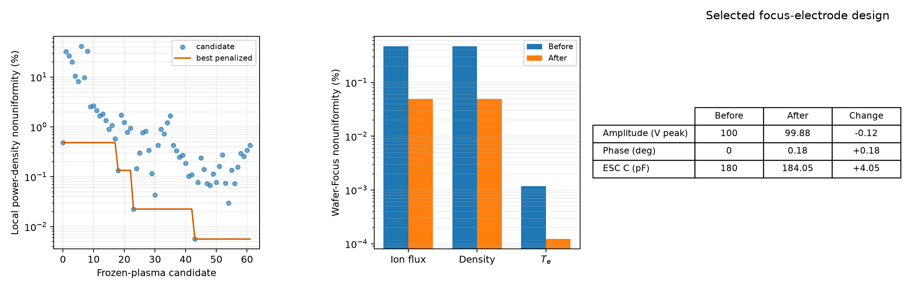

# Wafer―Focus Ring 二ゾーン均一性最適化

## 1. 結論

Wafer側とFocus-ring側のBohmイオン束をそろえることを目的に、Focus電源の振幅・位相とFocus ESC結合容量を制約付きで探索した。最適候補を二ゾーン自己無撞着グローバルモデルで厳密に再計算した結果、イオン束不均一度は

```text
0.4742% → 0.0490%
```

となり、モデル上で `89.7%` 改善した。全吸収電力の変化は `+0.262%`、最大平均シース電圧は `78.27 V` で、設定した全制約を満たした。

ただし、得られた変更量は振幅 `-0.12 V`、位相 `+0.18°`、容量 `+4.05 pF` と小さい。これは未校正モデルにおける鋭い最適点であり、そのまま実機レシピにする値ではない。実機へ進む前に、部品公差、電源校正誤差、プラズマ輸送係数の不確かさを含むロバスト最適化が必要である。

## 2. 目的と評価量

ゾーン `j` のBohmイオン束を

```text
Gamma_i,j = ne,j sqrt(e Te,j / mAr)
```

とし、Wafer―Focus不均一度を

```text
U_Gamma = abs(Gamma_i,W - Gamma_i,F)
          / mean(Gamma_i,W, Gamma_i,F)
```

で定義した。最終目的は `U_Gamma` の最小化である。これは二つの体積平均状態から得る局所代表値の差であり、Wafer面内の半径分布やFocus-ring境界の局所ピークを表すものではない。

## 3. 設計変数

Wafer側は基準条件に固定し、Focus側の三変数だけを変更した。

| 設計変数 | 探索範囲 | 基準値 | 選択値 | 変更量 |
|---|---:|---:|---:|---:|
| Focus電源振幅 | `80–120 V peak` | `100.00 V` | `99.88 V` | `-0.12 V` |
| Focus電源位相 | `-30–+30°` | `0.00°` | `+0.18°` | `+0.18°` |
| Focus ESC結合容量 | `90–360 pF` | `180.00 pF` | `184.05 pF` | `+4.05 pF` |

横方向R–L結合、Wafer ESC容量、圧力、周波数、粒子・熱輸送係数は基準モデルから変更していない。このため、今回の結果は「Focus側の電気条件だけでどこまで補償できるか」を調べたものになる。

## 4. 二段階探索

一つの設計候補を完全な自己無撞着モデルで評価すると、各反復でngspice過渡解析が必要になる。そこで、探索と物理確認を二段階に分けた。

### 4.1 凍結プラズマによる候補選別

基準点の `ne,W`、`ne,F`、`Te,W`、`Te,F` を固定し、各電気設計についてngspiceだけを再計算した。近似目的関数は、横RF電力移送を反映した局所吸収電力密度の不均一度

```text
U_P = abs(Pabs,W / VW - Pabs,F / VF)
      / mean(Pabs,W / VW, Pabs,F / VF)
```

とした。定常グローバルモデルでは局所吸収電力密度が密度とイオン束を強く支配するため、`U_P` は候補順位付けに使える。ただしプラズマ状態のフィードバックを含まないため、最終結論には使わない。

基準点、各軸の上下限、seed固定のSobol点から初期候補を作り、最良点の周囲を探索幅 `1.5%`、次に `0.3%` の3水準全因子で細分化した。重複を除く全75候補を2並列で計算し、62候補が成功、13候補はngspiceの周期収束に失敗した。失敗点には大きな目的関数を与え、候補から除外した。

### 4.2 自己無撞着な再検証

凍結プラズマ探索の上位4候補について、次の四変数を回路と反復連成した。

```text
ne,W, ne,F, Te,W, Te,F
```

この段階では、局所粒子収支、電子エネルギー収支、非線形シース、横方向R–L電力移送をすべて更新し、`U_Gamma` で順位を付け直した。選択候補はさらに厳しい相対変化・固定点残差 `2e-4` で最終確認した。

## 5. 制約

均一性だけを追って非現実的な高電圧や電力消失へ進まないよう、次を制約にした。

| 制約 | 上限または下限 | 最適点 | 判定 |
|---|---:|---:|:---:|
| 全プラズマ吸収電力の基準比変化 | `<= 10%` | `+0.262%` | 合格 |
| Powered sheath平均電圧の最大値 | `<= 120 V` | `78.27 V` | 合格 |
| Focusポート吸収電力 | `>= 0.02 W` | `0.211 W` | 合格 |
| 各ゾーン局所配分電力 | `>= 0.10 W` | 最小 `0.955 W` | 合格 |
| RF周期L2差 | `<= 2e-4` | `1.64e-4` | 合格 |
| Wafer見かけ反射振幅 | `<= 0.98` | `0.9266` | 合格 |
| Focus見かけ反射振幅 | `<= 0.999` | `0.9947` | 合格 |

ここで見かけ反射は各ポートを個別に50 Ω基準で評価した指標である。二入力間の相互電力を含むため、実機の方向性結合器で得る反射率と同一ではない。

## 6. 最適化結果



### 6.1 均一性

| 指標 | 基準 | 最適点 | 改善率 |
|---|---:|---:|---:|
| Bohmイオン束不均一度 | `0.474193%` | `0.049000%` | `89.67%` |
| 電子密度不均一度 | `0.473601%` | `0.048939%` | `89.67%` |
| 電子温度不均一度 | `0.001184%` | `0.000122%` | `89.68%` |
| Focus / Wafer イオン束比 | `0.995269` | `0.999510` | 1へ接近 |

最適点の状態は、

| 状態 | Wafer | Focus |
|---|---:|---:|
| `ne` | `2.29243e14 m^-3` | `2.29131e14 m^-3` |
| `Te` | `3.977432 eV` | `3.977427 eV` |
| Bohmイオン束 | `7.10526e17 m^-2 s^-1` | `7.10178e17 m^-2 s^-1` |

となった。

### 6.2 電力再配分

| 電力・電圧指標 | 基準 | 最適点 | 変化 |
|---|---:|---:|---:|
| 全プラズマ吸収電力 | `3.59119 W` | `3.60061 W` | `+0.00942 W` |
| Waferポート吸収電力 | `3.37679 W` | `3.38949 W` | `+0.01270 W` |
| Focusポート吸収電力 | `0.21440 W` | `0.21112 W` | `-0.00328 W` |
| Wafer局所配分電力 | `2.64192 W` | `2.64536 W` | `+0.00345 W` |
| Focus局所配分電力 | `0.94928 W` | `0.95524 W` | `+0.00597 W` |
| Wafer→Focus横RF移送 | `0.73487 W` | `0.74412 W` | `+0.00925 W` |
| Powered sheath平均電圧の最大値 | `78.13 V` | `78.27 V` | `+0.13 V` |

Focusポートが直接供給する電力はわずかに減っている一方、WaferからFocusへ渡る横RF電力は増えている。その結果、Focusゾーンの局所配分電力が増えた。したがって、この均一化は単純な「Focus電源を強くする」操作ではなく、振幅・位相・容量によって二つのbulk節点間のRF電力移送を微調整した結果と解釈できる。

## 7. 探索近似と最終評価の差

| 候補ID | 凍結プラズマ `U_P` | 自己無撞着 `U_Gamma` | 制約 |
|---:|---:|---:|:---:|
| 56 | `0.00562%` | `0.06452%` | 合格 |
| 36 | `0.02252%` | `0.06548%` | 合格 |
| 43 | `0.04310%` | `0.12729%` | 合格 |
| 61 | `0.06760%` | `0.18515%` | 合格 |

凍結近似は良い候補を絞り込めたが、値そのものは自己無撞着結果と一致しない。候補56は緩い再検証で `0.0645%`、厳しい最終固定点確認で `0.0490%` となった。ngspice過渡平均と外側固定点の小さな数値揺らぎが残るため、有効数字を過大に解釈せず「約 `0.05%`」と扱う。

## 8. 局所感度とロバスト性

選択点の周囲における凍結プラズマ指標は次のようになった。

| 変更 | 設計値 | `U_P` |
|---|---|---:|
| 選択点 | `99.88 V, +0.18°, 184.05 pF` | `0.00562%` |
| 容量 `-0.81 pF` | `99.88 V, +0.18°, 183.24 pF` | `0.10958%` |
| 位相を基準へ戻す | `99.88 V, 0.00°, 184.05 pF` | `0.18654%` |
| 振幅 `+0.12 V` | `100.00 V, +0.18°, 184.05 pF` | `0.16098%` |

小さな設定差で近似指標が変わるため、最適点は鋭い。これは精密制御の可能性を示すと同時に、実機の容量公差、ケーブル寄生、位相校正、温度ドリフトを無視できないことを意味する。教育上は「一点最適値」と「製造・運転に耐えるロバスト領域」が別物である好例である。

## 9. 数値品質

| 検証項目 | 結果 | 判定 |
|---|---:|:---:|
| 最終自己無撞着反復 | `5回` | 収束 |
| 最終4収支の最大相対残差 | `8.84e-5` | `< 2e-4` |
| 最終RF周期L2差 | `1.64e-4` | `< 2e-4` |
| ngspice全電力収支残差 | `1.33e-4` | 合格 |
| 制約違反 | 全項目 `0` | 合格 |

最終4収支残差は `0.00884%`、回路電力収支残差は `0.0133%` であり、報告した `0.049%` の差より小さい。ただし同程度の小数点以下の変動はあり得るため、さらに小さな不均一度を比較する場合は過渡解析期間と固定点停止条件の収束調査が必要になる。

## 10. 整合最適化との違い

前段の二入力整合最適化は電源から見た反射を下げる問題だった。今回はプラズマ内部の局所イオン束差を下げる問題であり、目的が異なる。実際、均一性は大きく改善したが、見かけ反射はWafer `0.9266`、Focus `0.9947` と基準近傍に残った。

したがって、次の実用設計では

```text
均一性 + 整合 + シース電圧 + 電力効率 + 公差感度
```

の多目的問題として扱う必要がある。

## 11. 解釈上の限界

1. 二ゾーンは体積平均モデルであり、Wafer面内分布やエッジ局所構造を解像しない。
2. 評価量は `ne uB` のBohm束であり、イオンエネルギー分布・入射角・材料応答を含まない。
3. 横方向電気結合、粒子・熱輸送係数、局所体積と接地面積配分は実機に未校正である。
4. 電源、ESC容量、ケーブル、計測系の公差とドリフトを確率変数として扱っていない。
5. 13個の広域候補がngspice周期収束に失敗した。これは候補を安全または危険と物理判定したものではなく、現在の数値設定で評価不能だったことを意味する。
6. 今回の `0.049%` はモデル内の代表値であり、実験均一性を保証しない。

## 12. 再実行

```powershell
uv sync
uv run pytest
uv run plasma-esc-uniformity-optimize `
  --optimization configs/esc_uniformity_optimization.json `
  --raw-output artifacts/esc_two_zone/uniformity_optimization `
  --summary-output reports/data/esc_uniformity_optimization.json `
  --figure-output reports/figures/esc_uniformity_optimization.png
```

探索条件は `configs/esc_uniformity_optimization.json`、集計値は `reports/data/esc_uniformity_optimization.json`、各候補のnetlist・波形・ngspiceログは `artifacts/esc_two_zone/uniformity_optimization` に保存される。Sobol seedは固定しているため候補集合は再現できるが、並列実行の表示順は変わり得る。

## 13. 次の実験計画

1. Focus容量を実測し、ケーブル・フィードスルー寄生容量を含む値へ更新する。
2. 位相差、両ポート電圧・電流、Powered sheathの校正可能な観測量で回路部を同定する。
3. `99.5–100.3 V`、`-0.3–+0.7°`、`180–188 pF` 付近を中心に、実機で実現可能な刻みと公差を使って局所再探索する。
4. 各設定でWafer/Focus境界を含むイオン電流または膜厚・エッチング指標を測定し、二ゾーン状態との対応を検証する。
5. 校正後のパラメータ分布を用い、平均不均一度ではなく95パーセンタイル不均一度を最小化するロバスト最適化へ進む。

この順番なら、数値上の一点最適値を追うのではなく、測定誤差と装置公差を含めても均一性を維持できる運転領域を設計できる。
