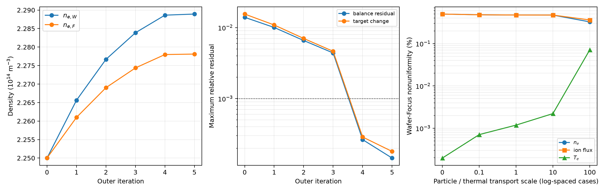

# Wafer―Focus Ring 二ゾーン自己無撞着グローバルモデル

## 1. 結論

二つの局所プラズマ状態

```text
ne,W, ne,F, Te,W, Te,F
```

を未知数とし、二ゾーン等価回路の ngspice 計算と、各ゾーンの粒子・電子エネルギー収支を反復する自己無撞着モデルを実装した。代表条件では6回の外側反復で収束し、Bohm イオン束の Wafer―Focus 不均一度は `0.474%` となった。

この値は代表幾何・代表輸送係数に対する二つの体積平均値の差であり、実機の面内分布を検証した値ではない。

## 2. 前段モデルからの拡張

[二ゾーン段階検証](ESC_二ゾーンモデル検証.md)では、固定した `ne, Te` の電気回路と、閉鎖系の保存的な横輸送を別々に検証した。今回は次のループで両者を接続した。

```text
局所 ne,Te
   ↓
シース電流・容量、局所bulk R-L、横方向 R-L を更新
   ↓
ngspiceで局所シース電圧・ポート電力・横RF電力を計算
   ↓
二つの粒子収支＋二つの電力収支を解く
   ↓
新しい ne,W, ne,F, Te,W, Te,F
```

状態更新は正値を保証するため対数空間で行い、固定回路に対する4本の収支は `scipy.optimize.least_squares`、回路との外側固定点は対数緩和で解いた。

## 3. 局所粒子収支

ゾーン `j` の電離生成と壁損失は、

```text
Siz,j   = ne,j ng Kiz(Te,j) Vj
Swall,j = ne,j uB(Te,j) (Ap,j + Ag,j)
```

とした。Wafer から Focus への粒子交換を

```text
GammaN = GN (ne,W - ne,F)
```

とすると、定常収支は

```text
Siz,W - Swall,W - GammaN = 0
Siz,F - Swall,F + GammaN = 0
```

である。二式を足すと横交換項が厳密に消え、全粒子収支だけが残る。

## 4. 局所電子エネルギー収支

既存の Schmidt 一ゾーングローバルモデルと一致するよう、損失を三成分へ分けた。

```text
Pcoll,j = Siz,j Ecoll(Te,j) e
Pe,j    = Swall,j 2 Te,j e
Pi,j    = ne,j uB e Sum_s As (Vs,s + Te,j/2)
Ploss,j = Pcoll,j + Pe,j + Pi,j
```

横方向の電子エネルギー交換は、粒子移流と熱伝導の和とした。

```text
Qadv  = (3/2) e Tdonor GammaN
Qcond = (3/2) e GE nbar (Te,W - Te,F)
QWF   = Qadv + Qcond
```

局所電力収支は、

```text
Pabs,W - Ploss,W - QWF = 0
Pabs,F - Ploss,F + QWF = 0
```

である。これも二式を足すと横交換項が消える。交換なし・局所粒子平衡の極限で、既存の `density_from_power_balance_surfaces` と同じ密度を返すことを単体試験で確認した。

## 5. 横RF電力の局所配分

各電源ポートの電力をそのまま局所吸収電力とすると、横方向 `R-L` 枝を通るRFエネルギー移送を誤って Wafer 側へ残してしまう。そこで、

```text
Ptrans = (Pbranch,in,W + Pbranch,out,F) / 2
Pabs,W = Pport,W - Ptrans
Pabs,F = Pport,F + Ptrans
```

と定義した。横枝両端電力の差は横抵抗損失であり、中点を使うことは損失を両ゾーンへ半分ずつ割り当てることに相当する。したがって、

```text
Pabs,W + Pabs,F = Pport,W + Pport,F
```

が数値的にも厳密に成立する。

## 6. 代表条件

- Ar、`2 Pa`、`300 K`、`13.56 MHz`
- Wafer/Focus-ring 両電源：`100 V peak`、同相
- Wafer ESC容量：`2.8 nF`
- Focus-ring ESC容量：`180 pF`
- 電気結合スケール：`1`
- 基準粒子・熱輸送係数：`GN=GE=2 m^3/s`
- シース微分容量係数：`alpha_C=0.5`
- 各反復：`480 RF周期`、保存`24周期`

体積と局所接地面積は、既存一ゾーン値を Wafer/Focus 表面積比で厳密に分割した。界面面積と輸送係数は代表仮定であり、装置校正値ではない。

## 7. 代表結果



### 7.1 プラズマ状態と均一性

| 指標 | Wafer | Focus | Focus / Wafer |
|---|---:|---:|---:|
| `ne` | `2.28892e14 m^-3` | `2.27811e14 m^-3` | `0.995275` |
| `Te` | `3.977572 eV` | `3.977525 eV` | `0.999988` |
| Bohmイオン束 | 基準 | — | `0.995269` |

不均一度を `abs(xW-xF)/mean(xW,xF)` と定義すると、

- 密度不均一度：`0.4736%`
- 電子温度不均一度：`0.00118%`
- Bohmイオン束不均一度：`0.4742%`

となった。

### 7.2 RF電力の移送

| 電力 | Wafer | Focus | 合計 |
|---|---:|---:|---:|
| 電源ポートからプラズマへ | `3.37679 W` | `0.21440 W` | `3.59119 W` |
| 横RF移送を反映した局所吸収 | `2.64192 W` | `0.94928 W` | `3.59119 W` |

横枝は Wafer 側から Focus 側へ `0.73487 W`、全プラズマ吸収電力の約 `20.5%` を移送した。これに対し、基準輸送係数における粒子移流＋熱伝導の電子エネルギー交換は `2.07 µW` である。

したがって、この代表条件で Focus 側の局所電力密度が Wafer 側へ近づく主因は、準中性な粒子・熱交換ではなく、有限の横方向インピーダンスを通るRF電力移送である。

### 7.3 数値品質

- 外側反復：`6回`
- 最終4収支の最大相対残差：`1.45e-4`（`0.0145%`）
- ngspice 全電力収支残差：`1.52e-5`（`0.00152%`）
- 最終周期 L2 差：`4.50e-5`
- 局所配分電力の和と全吸収電力の差：丸め誤差内で `0 W`

## 8. 粒子・熱輸送感度

電気的な横方向 `R-L` 結合は固定し、`GN` と `GE` を同時に倍率変更した。

| 輸送倍率 | `GN=GE` | 密度不均一度 | `Te`不均一度 | イオン束不均一度 | 最大収支残差 |
|---:|---:|---:|---:|---:|---:|
| 0 | `0 m^3/s` | `0.4993%` | `0.00020%` | `0.4994%` | `0.0593%` |
| 0.1 | `0.2 m^3/s` | `0.4793%` | `0.00071%` | `0.4796%` | `0.00869%` |
| 1 | `2 m^3/s` | `0.4736%` | `0.00118%` | `0.4742%` | `0.0145%` |
| 10 | `20 m^3/s` | `0.4722%` | `0.00222%` | `0.4733%` | `0.0447%` |
| 100 | `200 m^3/s` | `0.3264%` | `0.0713%` | `0.3620%` | `0.0757%` |

全点で最大収支残差 `<0.1%`、周期 L2 差 `<2e-4` を満たした。輸送を100倍にすると密度差は明確に低下する。一方、局所電力差を補う小さな温度勾配が形成されるため、イオン束不均一度は密度不均一度と完全には一致しない。

## 9. 検証項目

| 項目 | 合格条件 | 結果 | 判定 |
|---|---:|---:|:---:|
| 横RF電力配分 | 局所和 = 全吸収電力 | 全点で丸め誤差内 | 合格 |
| 交換項保存 | 二ゾーン和で消去 | 単体試験合格 | 合格 |
| 一ゾーン極限 | 既存電力収支と一致 | 相対誤差 `<1e-12` | 合格 |
| 構成した4変数解の回復 | 残差 `<1e-8` | 合格 | 合格 |
| 自己無撞着固定点 | 最大収支残差 `<0.1%` | 基準 `0.0145%` | 合格 |
| RF周期定常 | L2差 `<2e-4` | 基準 `4.50e-5` | 合格 |

## 10. 解釈上の限界

1. 二つのゾーンは体積平均値であり、Wafer半径方向や Focus-ring 境界の勾配を解像しない。
2. イオン束は `ne uB` による Bohm 束で、イオンエネルギー分布や入射角分布は未計算である。
3. `GN`、`GE`、界面面積、横方向有効衝突周波数は実機に対して未校正である。
4. 古典的な集中定数導電率を使い、圧力勾配・両極性電場・非局所電子動力学は明示的に解かない。
5. `0.474%` はモデル内の代表値であり、実験精度や製造均一性を保証しない。

## 11. 次の設計課題

均一性を直接改善する次段では、

- Focus電源の振幅・位相
- Focus ESC容量
- 横方向電気結合スケール
- Wafer/Focusの局所接地面積配分

を設計変数とし、自己無撞着に計算した Bohm イオン束不均一度を目的関数にする。反射だけを最小化した前段の整合最適化とは異なり、局所逆潮流、シース電圧、全吸収電力を制約として同時に扱う必要がある。

## 12. 再実行

```powershell
uv sync
uv run pytest
uv run plasma-esc-two-zone-coupled --config configs/esc_two_zone.json --output artifacts/esc_two_zone/self_consistent --summary reports/data/esc_two_zone_self_consistent.json --figure reports/figures/esc_two_zone_self_consistent.png
```

数値集計は `reports/data/esc_two_zone_self_consistent.json`、各反復の netlist・波形・ngspiceログは `artifacts/esc_two_zone/self_consistent` に保存される。

## 13. 参照

- [Schmidt et al. (2018), global model and equivalent circuit](https://doi.org/10.1088/1361-6595/aae429)
- [Wang et al. (2022), validity of classical plasma conductivity](https://doi.org/10.1088/1361-6595/ac95c1)
