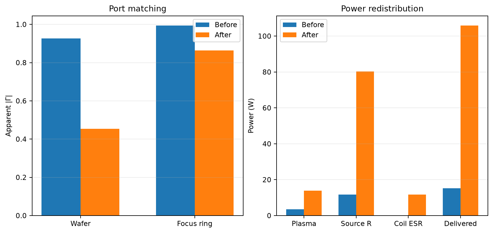
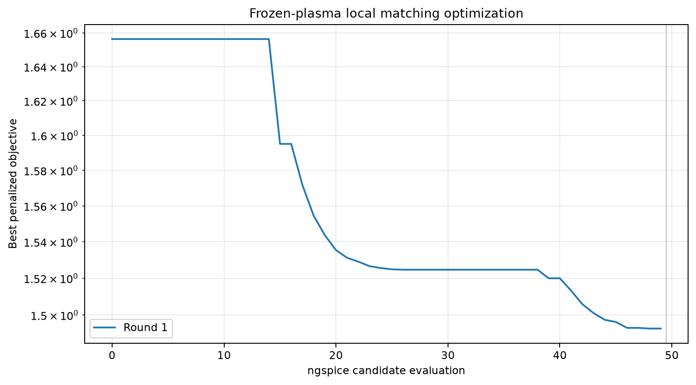

# Wafer―Focus Ring二入力プラズマ回路の整合最適化

## 1. この演習の結論

WaferとFocus ringを同時に駆動するESCプラズマ等価回路に、各入力の並列コンデンサと直列インダクタを追加し、解析設計、ngspice局所探索、グローバルモデル再収束の順に最適化した。

見かけの反射を表す目的関数は`1.8487`から`0.9528`へ48.5%低下し、プラズマ吸収電力は`3.53 W`から`13.96 W`へ増加した。ただし、Focus-ring枝では`-2.56 W`の逆潮流と`306 V`の平均シース電圧が生じた。したがって、これは「整合指標を改善した解」ではあるが、「プロセス均一性を満たす実機最適解」ではない。

この結果から学ぶべき点は、非線形プラズマでは次の三段階を分けて確認する必要があることである。

1. 回路だけを合わせる。
2. 回路変更で変化した電子密度を再計算する。
3. 整合以外のプロセス制約を確認する。



## 2. 学習目標

- 複素負荷からL型整合回路の初期値を導く。
- 二入力・共通プラズマでは単一ポートの`S11`として解釈できない理由を理解する。
- 短時間の回路最適化と、自己無撞着な長時間検証を分ける。
- コイルQ、周期収束、電力収支を最適化結果の合否判定へ含める。
- 整合改善とプロセス性能が同じ目的ではないことを数値で確認する。

## 3. 前提

### 3.1 プラズマと幾何

| 項目 | 値 | 備考 |
|---|---:|---|
| ガス | Ar | Maxwell型速度分布とグローバルモデル |
| 圧力 | 2 Pa | 代表条件 |
| ガス温度 | 300 K | 一様 |
| 周波数 | 13.56 MHz | 両電源共通 |
| 電源振幅 | 各100 V peak | 同相駆動 |
| Wafer面積 | 0.0706858 m² | 300 mm相当 |
| Focus-ring面積 | 0.0255254 m² | 仮定値 |
| 接地面積 | 0.2 m² | チャンバー接地面 |
| プラズマ体積 | 0.00288634 m³ | 0次元一様状態 |
| シース容量係数 | `alpha_C=0.5` | 物理的な微分容量 |

電子温度は三表面の粒子収支、電子密度はngspiceで得た吸収電力と三表面の平均シース電圧を用いるグローバル電力収支から計算する。空間分布、局所EEDF、電磁波伝搬は解かない。

この構成は、外部整合回路とグローバルプラズマ状態を自己無撞着に結合するSchmidtらの考え方を二表面ESCへ拡張したものである。元論文は[Schmidt et al. (2018)](https://doi.org/10.1088/1361-6595/aae429)を参照されたい。

### 3.2 回路

各入力枝は次の順序で接続する。

```text
100 Vpeak電源 ─ 50 Ω内部抵抗 ─┬─ 直列L（有限Q）─ ESC誘電体 ─ 表面シース ─ 共通プラズマ
                              └─ 入力並列C ─ GND
```

最適化変数は4個である。

- Waferの直列`Lw`と入力並列`Cw`
- Focus ringの直列`Lf`と入力並列`Cf`

コイルは理想素子とせず、設計周波数で`Q=30`、すなわち`R_L=omega L/Q`となる直列ESRを持たせる。高Q候補は凍結密度では良好でも、密度反復中に狭い共振を横切ると周期収束が悪化したためである。

### 3.3 数値条件

| 段階 | RF周期 | 保存周期 | 点/周期 | 用途 |
|---|---:|---:|---:|---|
| 候補探索 | 280 | 22 | 160 | 密度・温度を固定した比較 |
| 最終検証 | 600 | 24 | 240 | グローバル密度の再収束 |

最終合否条件は次のとおりである。

- 密度残差：`1e-3`未満
- 最大周期L2差：`2e-4`未満
- 上の二条件を3回連続で満たす
- 密度反復：最大30回
- 全系電力収支残差を別途監査する

## 4. 目的関数

両電源を同時に同相駆動した運転点で、基本波の見かけの入力インピーダンスを

```text
Zapp,j = V1,j / I1,j
Gamma_j = (Zapp,j - 50) / (Zapp,j + 50)
Jmatch = |Gamma_wafer|^2 + |Gamma_focus|^2
```

と定義した。候補探索では、周期差が許容値を超える場合に二乗ペナルティを加える。

```text
J = Jmatch + 0.02 max(0, cycle_L2 / 2e-4 - 1)^2
```

ここで`Zapp`は、もう一方の電源も動作している特定の大信号運転点の比である。相互結合した二ポートの孤立`S11`ではない。多ポートとして厳密に扱う場合は、Kurokawaのpower waveに基づく入射波・反射波ベクトルを使う必要がある。[Kurokawa, “Power Waves and the Scattering Matrix”](https://doi.org/10.1109/TMTT.1965.1125964)を参照されたい。

本レポートでは教育上の簡潔さを優先し、等振幅・同相の一運転点に対する`Jmatch`を使う。`sqrt(Jmatch/2)`はこの条件でのTARCに似た指標だが、非線形高調波を含む完全な散乱行列評価ではない。

## 5. 手順

### 手順1：未整合回路を測る

自己無撞着な基準計算から、次の見かけの負荷を得た。

```text
Wafer      Zapp = 17.06 - j140.68 Ω
Focus ring Zapp = 11.15 - j450.79 Ω
```

### 手順2：解析的なL型整合値を求める

負荷を`ZL=R+jX`、基準抵抗を`R0=50 Ω`とする。入力並列C、負荷側直列Lのトポロジーでは、正のリアクタンス枝を選ぶと

```text
Xbranch = sqrt(R (R0 - R))
L = (Xbranch - X) / omega
C = Xbranch / {omega (R^2 + Xbranch^2)}
```

となる。未整合回路の既存`50 nH`をディエンベッドした解析値は次のとおりである。

| 枝 | 解析L | 解析C |
|---|---:|---:|
| Wafer | 1.979 µH | 326.1 pF |
| Focus ring | 5.585 µH | 438.2 pF |

ただし、これは各枝を独立線形負荷とみなした初期値にすぎない。両枝を同時に変更すると、シース波形と電子密度が変化する。

### 手順3：頑健な探索範囲へ制限する

高Q・完全整合付近の試行では、短時間解析が未定常波形を低反射と誤認した。また自己無撞着な密度固定点付近で狭帯域共振が生じた。この監査から、解析値の約75%を上限とする次の範囲へ制限した。

| 変数 | 下限 | 上限 |
|---|---:|---:|
| `Lw` | 0.10 µH | 1.50 µH |
| `Cw` | 50 pF | 250 pF |
| `Lf` | 0.50 µH | 4.20 µH |
| `Cf` | 50 pF | 335 pF |

### 手順4：凍結プラズマで局所探索する

電子温度と密度を基準点に固定し、4変数を範囲`0–1`へ正規化してPowell法で探索した。50回のngspice候補評価を行い、最適化ソルバーの最終点ではなく評価履歴全体から最小値を選んだ。



### 手順5：密度を再収束して採否を決める

凍結プラズマ最良候補の評価48は30密度反復で厳密条件に届かなかったため棄却した。次点の評価46を検証すると22反復で収束した。局所探索の最小値を無条件に採用しないことが重要である。

## 6. 結果

### 6.1 採用部品値

| 枝 | 未整合L | 未整合C | 最適化L | 最適化C | Q |
|---|---:|---:|---:|---:|---:|
| Wafer | 0.050 µH | 0 pF | 1.4957 µH | 50.62 pF | 30 |
| Focus ring | 0.050 µH | 0 pF | 4.1885 µH | 54.30 pF | 30 |

### 6.2 整合・プラズマ・電力

| 指標 | 未整合 | 最適化後 | 変化 |
|---|---:|---:|---:|
| `Jmatch` | 1.8487 | 0.9528 | -48.5% |
| TARC類似指標`sqrt(J/2)` | 0.9614 | 0.6902 | -28.2% |
| Wafer `|Gamma|` | 0.9271 | 0.4543 | 改善 |
| Focus `|Gamma|` | 0.9946 | 0.8639 | 改善 |
| 電子密度 | `2.246e14 m^-3` | `7.065e14 m^-3` | 3.15倍 |
| プラズマ総吸収電力 | 3.527 W | 13.961 W | 3.96倍 |
| 電源内部抵抗損失 | 11.712 W | 80.208 W | 増加 |
| コイルESR損失 | 0.033 W | 11.686 W | 増加 |
| 電源から外部回路への正味電力 | 3.572 W | 25.725 W | 7.20倍 |
| 最大周期L2差 | `6.60e-5` | `4.67e-5` | 合格 |
| 電力収支残差 | 0.0420% | 0.0192% | 合格 |

`source_delivered_total_w`は理想電圧源の仕事であり、50 Ω内部抵抗損失を引く前の値である。本表の正味電力は`source delivered - source R loss`で計算した。

### 6.3 表面別の副作用

| 指標 | 未整合 | 最適化後 |
|---|---:|---:|
| Wafer枝プラズマ電力 | 3.306 W | 16.522 W |
| Focus枝プラズマ電力 | 0.221 W | -2.561 W |
| Wafer平均シース電圧 | 78.40 V | 82.96 V |
| Focus平均シース電圧 | 77.33 V | 305.78 V |
| Ground平均シース電圧 | 39.56 V | 49.35 V |

Focus枝の負電力は、共通プラズマを介してFocus側へRF電力が戻る運転点を示す。二電源が独立負荷を駆動しているという単純な解釈は成立しない。また、Focusシース電圧の大幅な上昇はエッジ損傷や均一性の観点から望ましくない可能性がある。

## 7. この最適化を実験へ移す手順

1. 両電極を低振幅で駆動し、基本波の端子電圧・電流・位相を測る。
2. Wafer側から解析値の25%、50%、75%の順にLとCを変更する。
3. 各点でFocus側の受電方向、DC self-bias、電流高調波を確認する。
4. Focus側も同様に段階変更し、同時駆動時の相互作用を測る。
5. 発光分布、密度指標、Wafer/Focusのイオンエネルギー指標を整合度と同時に記録する。
6. Focus側電力が負、またはシース電圧が上限を超えた条件は、反射が小さくても不採用とする。

実験ではコイルの実測Q、浮遊容量、ケーブル長、電源間位相を設定ファイルへ反映する。初回は部品定格に十分な余裕を持たせ、電圧・電流・温度のインターロックを使用する。

## 8. 再現方法

```powershell
uv sync
uv run pytest
uv run plasma-esc-optimize --optimization configs/esc_matching_optimization.json
```

主な出力は次のとおりである。

- 集計値：`reports/data/esc_matching_optimization.json`
- 収束図：`reports/figures/esc_matching_convergence.png`
- 前後比較図：`reports/figures/esc_matching_before_after.png`
- 各候補のnetlist・ログ・波形：`artifacts/esc_wafer_focus_ring/matching_optimization/`

使用したngspiceの一般的な仕様は[ngspice documentation](https://ngspice.sourceforge.io/docs.html)を参照されたい。

## 9. 限界と次の課題

- `Zapp`は特定の同相・等振幅運転点の見かけ値であり、完全な大信号二ポートSパラメータではない。
- グローバルモデルは空間一様なので、Wafer中心―端部の局所密度分布を予測しない。
- 部品Qと寄生成分は仮定値であり、実測に置き換える必要がある。
- 整合だけを目的にすると、逆潮流と過大なFocusシース電圧を許してしまう。

次の最適化では、`Jmatch`に加えて次を制約または目的へ入れるべきである。

```text
P_focus >= 0
Vsheath_focus <= 設計上限
|Vsheath_wafer - Vsheath_focus| <= 均一性上限
source R loss + coil ESR loss を最小化
```

さらに、両電源の位相差を設計変数へ加え、power-waveベクトルに基づく多ポート指標とプロセス指標のPareto前線を作ることが次の段階である。
