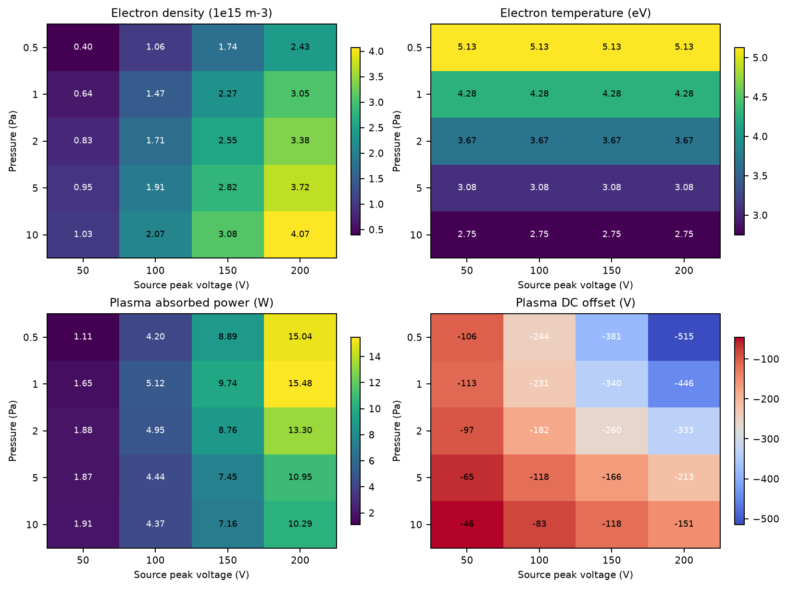
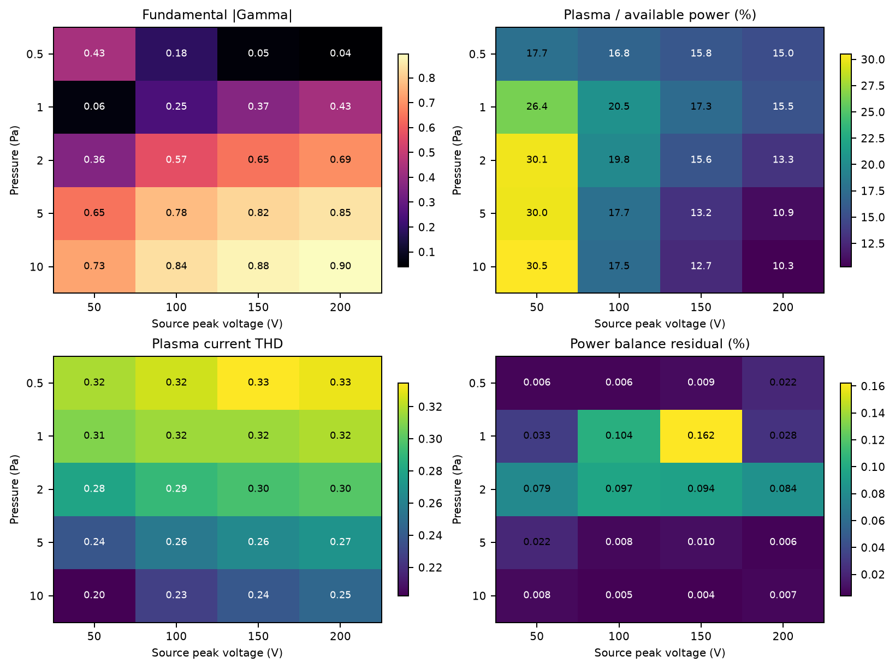

# 圧力―電源振幅の範囲外予測マップ

作成日: 2026-09-02

## 結論

Schmidt標準点で校正したプラズマ等価回路とグローバルモデルを変更せず、圧力 `0.5–10 Pa`、電源ピーク振幅 `50–200 V` の20条件へ外挿した。整合器は論文値 `C_m1=1550 pF`、`C_m2=175 pF` に固定し、各条件で再整合していない。

- 20条件すべてでngspice解と有限な物理量を取得し、計算例外はなかった。
- 全20条件が密度残差とRF周期収束の両方を満たした。
- `1 Pa, 200 V` は300周期では周期収束閾値をわずかに超えたため、450周期へ延長して収束を確認した。
- 電力収支残差は全条件で `0.163%` 以下だった。
- 電子密度は `3.98e14–4.07e15 m^-3`、プラズマ吸収電力は `1.11–15.48 W` となった。
- 固定整合回路の反射係数 `|Gamma|` は `0.040–0.896` と大きく変化し、圧力上昇側では著しく不整合になった。

これは実験検証前のモデル予測であり、装置性能の保証値ではない。特に `alpha_C=0.5862` は標準点校正値であるため、[容量規約監査](Capacitance規約監査.md) と併せて解釈する。

## 1. 計算条件

| 項目 | 設定 |
|---|---|
| ガス・形状・周波数 | Schmidt標準条件のAr、電極形状、`13.56 MHz` |
| 圧力 | `0.5, 1, 2, 5, 10 Pa` |
| 電源振幅 | `50, 100, 150, 200 V peak` |
| 整合回路 | 論文値に固定、条件ごとの再調整なし |
| 容量係数 | `alpha_C=0.5862` に固定 |
| 数値正則化 | `delta_C=delta_e=0.05 V` |
| 連続解 | 各圧力で100 Vを基準に、低電圧側、高電圧側へ密度を引き継ぐ |
| 収束 | 密度相対残差 `<1e-3`、周期L2差 `<2e-4` を3回連続 |

電子温度は論文と同じ粒子収支で圧力ごとに決まり、この簡略モデルでは同一圧力内で電源振幅に依存しない。密度は各条件のngspice吸収電力と平均シース電圧から自己無撞着に反復した。

## 2. プラズマ状態



| 圧力 (Pa) | `T_e` (eV) | `n_e` 範囲 (`1e15 m^-3`) | `P_pl` 範囲 (W) | DC自己バイアス範囲 (V) |
|---:|---:|---:|---:|---:|
| `0.5` | `5.13` | `0.40–2.43` | `1.11–15.04` | `-106–-515` |
| `1` | `4.28` | `0.64–3.05` | `1.65–15.48` | `-113–-446` |
| `2` | `3.67` | `0.83–3.38` | `1.88–13.30` | `-97–-333` |
| `5` | `3.08` | `0.95–3.72` | `1.87–10.95` | `-65–-213` |
| `10` | `2.75` | `1.03–4.07` | `1.91–10.29` | `-46–-151` |

主な傾向は次のとおりである。

1. 各圧力で電源振幅を上げると電子密度と吸収電力が単調に増える。
2. 圧力を上げると粒子収支で決まる電子温度は低下する。
3. 同じ電源振幅では、高圧側ほど密度が高い一方、100 V以上ではプラズマ吸収電力が低下する。これは固定整合器の不整合増大と整合器・寄生枝の損失が同時に効くためである。
4. 非対称電極により負の自己バイアスが生じ、低圧・高振幅ほど絶対値が大きくなる。

## 3. 外部回路との相互作用



| 圧力 (Pa) | `|Gamma|` 50/100/150/200 V | プラズマ/利用可能電力 50/100/150/200 V (%) |
|---:|---|---|
| `0.5` | `0.43 / 0.18 / 0.05 / 0.04` | `17.7 / 16.8 / 15.8 / 15.0` |
| `1` | `0.06 / 0.25 / 0.37 / 0.43` | `26.4 / 20.5 / 17.3 / 15.5` |
| `2` | `0.36 / 0.57 / 0.65 / 0.69` | `30.1 / 19.8 / 15.6 / 13.3` |
| `5` | `0.65 / 0.78 / 0.82 / 0.85` | `30.0 / 17.7 / 13.2 / 10.9` |
| `10` | `0.73 / 0.84 / 0.88 / 0.90` | `30.5 / 17.5 / 12.7 / 10.3` |

固定整合器の最良点は、0.5 Paでは150–200 V、1 Paでは50 V付近へ移る。2 Pa以上では全電圧で `|Gamma|>0.36` となり、5–10 Paではほぼ全域が強い不整合である。したがって、標準点だけで決めた整合容量を広い運転領域へそのまま使う設計は適切でない。

プラズマ電流THDは低圧側ほど高く、`0.20–0.33` の範囲だった。低圧で高調波が強くなるという論文の議論と定性的に整合するが、未測定条件なので実験との一致を意味しない。

## 4. 数値品質

| 検査 | 結果 |
|---|---:|
| 条件数 | `20` |
| 計算例外 | `0` |
| 厳密収束 | `20/20` |
| 延長過渡が必要だった条件 | `1 Pa, 200 V`（`450`周期） |
| 最大周期電圧L2差 | `9.79e-5` |
| 最大周期電流L2差 | `1.68e-4` |
| 最大電力収支残差 | `0.1623%` |
| `P_load/P_available` と `1-|Gamma|^2` の最大差 | `7.49e-5` |

`1 Pa, 200 V` は標準の300周期で密度固定点へ到達したものの、周期電流L2差が閾値を約`0.5%`だけ上回った。過渡を450周期へ延長すると3密度反復で周期電流L2差 `2.01e-5` まで低下し、全ゲートを通過した。スイープ実装にはこの延長再試行を組み込んだ。

## 5. 実験で優先する条件

モデルの外挿性能と整合器相互作用を少ない測定点で識別するには、次の順が効率的である。

1. `1 Pa, 50/100/150 V`: 整合が良い点から崩れる方向を連続確認する。
2. `0.5 Pa, 50/100/150 V`: 逆に高振幅側で整合が改善する予測を検証する。
3. `2 Pa, 50/100 V`: 高圧側の不整合開始と吸収電力の頭打ちを確認する。
4. `5 Pa, 100 V`: 強い不整合領域の代表点として測定する。

各点で、電極直近の基本波複素インピーダンス、`<v i>`、DC自己バイアス、2–12次電流高調波を保存する。整合容量は走査中に変えず、まず予測と同じ固定回路で比較する。その後に再整合実験を別系列として行う。

全20条件の機械可読データは [pressure_voltage_map.json](data/pressure_voltage_map.json) に保存した。

## 再実行

```powershell
uv sync
uv run plasma-map `
  --sweep configs/pressure_voltage_sweep.json `
  --raw-output artifacts/pressure_voltage_map `
  --summary-output reports/data/pressure_voltage_map.json `
  --figure-directory reports/figures
```

20条件の計算には数分かかる。途中のnetlist、波形、ログは `artifacts/pressure_voltage_map/` に保存される。
