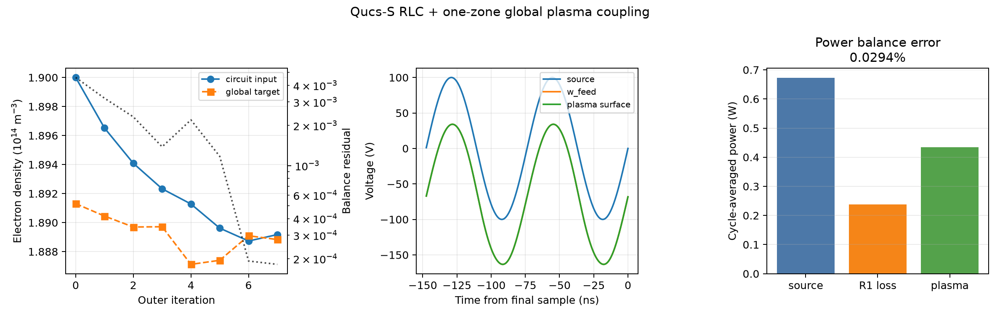

# Qucs-S RLC外部回路と一ゾーンプラズマの自己無撞着連成

## 1. 結論

Qucs-S 26.1.0から出力したWafer側直列RLC回路を正規化し、Schmidt et al. (2018)に基づく一ゾーンAr-CCPグローバルモデルとngspiceで自己無撞着に連成した。

計算は8回の外部反復で収束し、`Te = 4.7493 eV`、`ne = 1.8892e14 m^-3`、プラズマ吸収電力`0.4340 W`を得た。最終点では密度収支残差`0.0181%`、RF周期間L2差`0.00140%`、回路電力収支残差`0.0294%`であり、設定した数値ゲートをすべて満たした。

一方、ダミー50 Ωに対して共振するよう選んだRLCは、このプラズマ負荷には整合していない。最終入力インピーダンスは`155.68 - j1064.84 Ω`と強い容量性である。今回の結果は「Qucs-S netlistを非線形プラズマへ接続し、グローバルモデルまで閉じた」ことの検証であり、整合済み装置の予測ではない。



## 2. 入力回路

Qucs-Sから出力されたダミーロードなしのnetlistを、リポジトリ内の[`qucs/exported/01_RLC_wafer_only.cir`](../qucs/exported/01_RLC_wafer_only.cir)へ保存した。

| 要素 | 値 |
|---|---:|
| RF電源 | `100 V peak`、`13.56 MHz` |
| 直列抵抗R1 | `50 Ω` |
| 直列インダクタL1 | `138 nH` |
| 直列コンデンサC1 | `1 nF` |
| プラズマ接続Wire Label | `w_feed` |

ダミー負荷によるQucs-S単体確認では、R2=`50 Ω`を`w_feed`から接地へ接続し、20 RF周期を計算した。保存データは10012点、解析時間は20.00005周期であり、最後の5周期を正弦波フィットした`w_feed`振幅は`49.999994 V`だった。これは共振時の50 Ω―50 Ω分圧による解析値`50 V`と実質的に一致する。

連成計算ではR2を削除し、`w_feed`の先へPythonが電流計測用0 V電圧源とプラズマ等価回路を挿入する。したがって、この一ゾーン構成ではQucs-S回路側に電流計を置く必要はなく、固定すべき契約はWire Labelの`w_feed`とRLC・電源のRefDesである。

## 3. netlist正規化と接続

実装はQucs-S出力を直接上書きせず、各反復で次の処理を行う。

1. Qucs-Sが生成した`.control`―`.endc`、`.tran`、末尾`.end`を除去する。
2. 今回の回路では未使用の`ngspice_mathfunc.inc`絶対パスを除去する。
3. `w_feed`、R1、L1、C1、V1の存在を検査する。
4. ダミー負荷R2が残っていればエラーにする。
5. V1を、定常状態では元のSIN電源と等価な滑らかな立上り電源へ置換する。
6. `w_feed`へ0 V電圧源`Vsense_surface_wafer`と一ゾーンプラズマを接続する。
7. Python管理の解析条件を一つだけ付加してngspiceを実行する。

各反復ディレクトリには、元netlist、正規化後netlist、最終`case.cir`、ngspiceログ、波形、実行条件を保存する。これによりQucs-S由来の回路とPythonが追加したプラズマ部分を追跡できる。

## 4. プラズマモデル

プラズマ等価回路は、Powered sheath、準中性bulkのR―L、Grounded sheathを直列に接続した一ゾーンモデルである。電子温度は粒子収支から、電子密度は回路で得た吸収電力と平均シース電圧を用いる電力収支から更新する。

シース容量と電子電流はゼロ電圧近傍で滑らかに正則化した。

```text
Vabs_delta(V)  = sqrt(V^2 + delta_C^2)
Vplus_delta(V) = (V + sqrt(V^2 + delta_e^2)) / 2
C_s,reg        = alpha_C sqrt(K / Vabs_delta(V_s))
I_e,reg        = I_e,sat exp(-Vplus_delta(V_s) / T_e)
```

今回は物理的な微分容量として`alpha_C = 0.5`を採用し、`delta_C = delta_e = 0.05 V`とした。計算領域は既存Schmidt再現モデルと同じ一ゾーン形状で、圧力`0.66 Pa`、Powered面積`0.01 m²`、Grounded面積`0.03 m²`、bulk長`0.057 m`である。

## 5. 数値計算条件

| 項目 | 設定 |
|---|---:|
| 過渡解析長 | 960 RF周期 |
| 保存区間 | 最終32 RF周期 |
| 最大刻み | 1周期あたり400点 |
| 電源立上り | 10 RF周期の`tanh`ランプ |
| 密度初期値 | `1.9e14 m^-3` |
| 密度緩和係数 | `0.4` |
| 密度収束許容値 | `1e-3` |
| 連続収束回数 | 2回 |
| RF周期L2許容値 | `2e-4` |
| 最大外部反復 | 12回 |

元の100 V電源を時刻0から直接印加すると、プラズマの非線形シースとRLCの組合せでngspiceが`Timestep too small`となった。このため、定常振幅・周波数・位相を変えず、最初の10周期だけ`tanh`で滑らかに立ち上げた。保存・評価区間はランプ終了から十分離れている。

また、短い過渡解析や粗い保存刻みでは、波形が見かけ上周期収束していても数値積分した電力収支に偏りが残った。960周期・400点/周期では、周期収束と電力収支を同時に満たした。

## 6. 自己無撞着反復の結果

| 量 | 最終値 |
|---|---:|
| 外部反復回数 | 8 |
| 電子温度`Te` | `4.7492937 eV` |
| 電子密度`ne` | `1.8891743e14 m^-3` |
| 電力収支からの目標密度 | `1.8888317e14 m^-3` |
| 密度収支相対残差 | `1.8133e-4`（`0.01813%`） |
| Powered sheath平均電圧 | `103.603 V` |
| Grounded sheath平均電圧 | `39.214 V` |
| プラズマ電圧基本波振幅 | `99.445 V` |
| プラズマ電圧DCオフセット | `-64.389 V` |
| プラズマ電流基本波振幅 | `92.932 mA` |
| プラズマ電流THD | `32.25%` |

電子密度は初期値`1.9000e14 m^-3`から小さく更新され、8反復目で2回連続して密度とRF周期の条件を満たした。大きな電流THDは、電圧依存シース容量と指数関数的電子電流を含む非線形負荷による。

## 7. 回路結果と電力収支

| 量 | 最終値 |
|---|---:|
| 電源供給電力 | `0.672185 W` |
| R1損失 | `0.238366 W` |
| プラズマ吸収電力 | `0.434017 W` |
| `R1損失 + プラズマ吸収` | `0.672383 W` |
| 電力収支相対残差 | `2.9433e-4`（`0.02943%`） |
| 電源から見た入力インピーダンス | `155.676 - j1064.836 Ω` |
| `w_feed`から見た負荷インピーダンス | `105.806 - j1064.842 Ω` |

R1、L1、C1は直列なので、電源電流とプラズマ電流の基本波振幅はほぼ同じ`92.93 mA`である。ダミー50 Ωの場合と異なり、プラズマ負荷には大きな容量性リアクタンスが残る。R1では供給電力の約35.5%が失われ、約64.6%がプラズマへ吸収された。

## 8. 検証ゲート

| 検証項目 | 合格条件 | 結果 | 判定 |
|---|---:|---:|---|
| 自己無撞着密度残差 | `< 1e-3` | `1.813e-4` | 合格 |
| 最終周期電圧L2差 | `< 2e-4` | `5.068e-6` | 合格 |
| 最終周期電流L2差 | `< 2e-4` | `1.399e-5` | 合格 |
| 回路電力収支残差 | `< 1e-3` | `2.943e-4` | 合格 |
| 状態量 | 正かつ有限 | `Te > 0`、`ne > 0` | 合格 |

単体テストでは、RLCと`w_feed`の保持、Qucs-S解析命令の除去、R2残存時の拒否、電流計測源と非線形プラズマの挿入、`.control`と`.end`が一つだけであることを確認する。

## 9. 再現手順

リポジトリ直下で次を実行する。

```powershell
uv sync
uv run plasma-qucs-one-zone `
  --config configs/qucs_rlc_one_zone.json `
  --output artifacts/qucs_rlc_one_zone/self_consistent `
  --summary reports/data/qucs_rlc_one_zone.json `
  --figure reports/figures/qucs_rlc_one_zone.png
```

ngspiceは設定ファイルで`C:\Spice64\bin\ngspice_con.exe`を指定している。反復ごとの生成netlistと波形は`artifacts/qucs_rlc_one_zone/`へ、検証済み集計値は[`reports/data/qucs_rlc_one_zone.json`](data/qucs_rlc_one_zone.json)へ保存される。

## 10. 適用範囲と次の課題

- 今回はWaferのみの一ゾーンであり、Focus ringと横方向輸送は含まない。
- LとCは理想素子で、コイル有限Q、配線・ケーブル寄生、ESC誘電損失は未同定である。
- `0.434 W`と`1.889e14 m^-3`は現設定のモデル結果であり、実験校正済みの装置予測ではない。
- 電源ランプは初期値問題を安定化する数値処理であり、定常回路の部品値は変更しない。
- L、負荷側並列C、有限Qを含む探索は[Qucs-S RLC整合条件探索](Qucs-S_RLC整合条件探索.md)で実施済みである。次段階では実部品の自己共振周波数・実測Q・寄生容量と効率を制約へ加える。

## 11. 主要ファイル

- [`configs/qucs_rlc_one_zone.json`](../configs/qucs_rlc_one_zone.json)：回路契約、物理条件、過渡解析、固定点条件
- [`src/plasma_circuit/qucs_one_zone.py`](../src/plasma_circuit/qucs_one_zone.py)：正規化、接続、ngspice実行、波形解析、固定点反復
- [`src/plasma_circuit/qucs_one_zone_cli.py`](../src/plasma_circuit/qucs_one_zone_cli.py)：コマンド、JSON、図の出力
- [`tests/test_qucs_one_zone.py`](../tests/test_qucs_one_zone.py)：netlist契約と組立の単体テスト
- [`reports/data/qucs_rlc_one_zone.json`](data/qucs_rlc_one_zone.json)：全反復と最終数値
