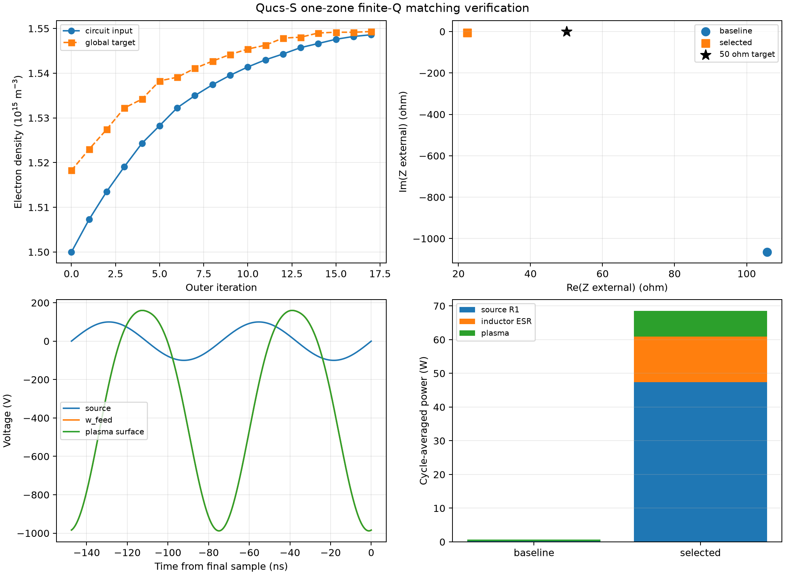

# Qucs-S RLC一ゾーンプラズマの整合条件探索

## 1. 結論

Qucs-Sから出力した一ゾーン外部回路について、直列L1、直列C1、負荷側並列コンデンサ、コイル有限Qを用いた整合条件を探索した。

採用条件は次のとおりである。

| 素子 | 採用値 |
|---|---:|
| 直列インダクタL1 | `5.0 µH` |
| L1のQ | `30` at 13.56 MHz |
| L1の等価直列抵抗 | `14.20 Ω` |
| 直列コンデンサC1 | `1.0 nF` |
| `w_feed`―GND並列コンデンサ | `12 pF` |

自己無撞着な最終計算では、50 Ω電源抵抗をディエンベッドした外部負荷が`105.68 - j1064.84 Ω`から`22.45 - j6.18 Ω`へ移動し、基本波反射係数の大きさは`0.9908`から`0.3883`へ60.8%低下した。完全な50 Ω整合には届かないが、密度収支、RF周期収束、回路電力収支をすべて満たした候補の中では最良だった。



## 2. 整合指標

理想電圧源とQucs-S回路の間にはR1=`50 Ω`がある。ngspiceで計測する入力インピーダンスにはR1が含まれるため、外部負荷は次のようにディエンベッドした。

```text
Zexternal = Zinput - 50 ohm
Gamma = (Zexternal - 50) / (Zexternal + 50)
```

したがって完全整合の目標は`Zexternal = 50 + j0 Ω`であり、R1を含む全入力では`100 + j0 Ω`に対応する。非線形プラズマは高調波を発生するため、`Gamma`は13.56 MHz基本波の見かけ指標として用い、最終採否には時間領域電力収支も含めた。

## 3. 探索した回路

基準回路は次の直列構成だった。

```text
100 Vpeak source -- R1=50 ohm -- L1=138 nH -- C1=1 nF -- w_feed -- plasma
```

基準プラズマ負荷は強い容量性だったため、L1を増やして直列補償し、さらに`w_feed`からGNDへの並列Cを加える負荷側L型整合を探索した。

```text
100 Vpeak source -- R1 -- L1(Q=30) -- C1 --+-- plasma
                                               |
                                               Csh
                                               |
                                              GND
```

C1=`1 nF`はDCブロックとして固定した。L1とCshを主な設計変数とし、各探索ラウンドでプラズマ密度を固定して候補を選別した後、上位候補の密度をグローバルモデルで再収束した。

## 4. 理想L探索で判明した問題

基準プラズマを線形負荷とみなすと、直列のみのリアクタンス補償値はL1約`12.6 µH`となる。しかし実際には電圧上昇によってシース容量、電子電流、吸収電力、電子密度が変化し、共振点が移動した。

理想インダクタのまま反射が小さい領域へ近づくと、次が発生した。

- 入力リアクタンスが連続的にゼロを横切らず、非線形定常枝が切り替わる。
- 固定密度では低反射に見える候補が、密度再収束後に別の低電力枝へ移る。
- 密度残差が小さくてもRF周期間L2差が`1e-3–5e-3`に残る。
- 未定常波形では電力収支誤差が数%から10%に達する。

例えば理想Lの`L1=6 µH`、`Csh=10 pF`は密度残差`6.20e-4`まで進んだが、周期L2差`3.00e-3`、電力収支誤差`5.45%`であり不採用とした。

## 5. 有限Qによる安定化

実コイルを想定し、設計周波数で

```text
R_ESR = omega L / Q
```

を直列に追加した。Q=`30`、L1=`5 µH`では`R_ESR=14.20 Ω`である。損失は増えるが、理想Lで生じた極端な高Q共振を減衰させ、自己無撞着な定常解を評価できるようになった。

代表的な探索経路は次のとおりである。

| 段階 | L1 | Csh | Q | `ne` | `|Gamma|` | 判定 |
|---|---:|---:|---:|---:|---:|---|
| 基準 | 0.138 µH | 0 pF | 理想 | `1.889e14` | `0.9908` | 合格 |
| 有限Q 第1段階 | 6.0 µH | 15 pF | 30 | `7.723e14` | `0.8175` | 合格 |
| 有限Q 第2段階 | 5.0 µH | 15 pF | 30 | `1.301e15` | `0.5284` | 合格 |
| 採用点 | 5.0 µH | 12 pF | 30 | `1.549e15` | `0.3883` | 合格 |
| 低反射境界 | 6.0 µH | 8 pF | 30 | `1.638e15` | `0.3795` | 周期不収束 |

最後の候補は反射だけなら採用点よりわずかに小さいが、周期L2差`1.37e-3`と電力収支誤差`2.28%`のため棄却した。探索値の詳細は[`reports/data/qucs_rlc_matching_exploration.json`](data/qucs_rlc_matching_exploration.json)に保存した。

## 6. 採用点の自己無撞着結果

| 量 | 基準 | 採用点 | 変化 |
|---|---:|---:|---:|
| 外部負荷`Zexternal` | `105.68-j1064.84 Ω` | `22.45-j6.18 Ω` | 容量性虚部をほぼ補償 |
| `|Gamma|` | `0.9908` | `0.3883` | `-60.8%` |
| 電子密度 | `1.889e14 m^-3` | `1.549e15 m^-3` | 8.20倍 |
| プラズマ吸収電力 | `0.434 W` | `7.611 W` | 17.5倍 |
| Powered sheath平均電圧 | `103.60 V` | `436.78 V` | 4.22倍 |
| プラズマ電圧基本波振幅 | `99.45 V` | `578.33 V` | 5.82倍 |
| プラズマ電圧DCオフセット | `-64.39 V` | `-347.98 V` | 絶対値増加 |
| プラズマ電流THD | `32.25%` | `7.48%` | 低下 |

採用点は18回の外部反復で収束した。最終密度は`1.548600e15 m^-3`、電力収支からの目標密度は`1.549317e15 m^-3`だった。

## 7. 電力収支と効率

| 電力 | 採用点 |
|---|---:|
| 理想電圧源の供給電力 | `68.513 W` |
| 電源抵抗R1損失 | `47.432 W` |
| コイルESR損失 | `13.471 W` |
| プラズマ吸収電力 | `7.611 W` |
| 時間領域電力収支誤差 | `8.36e-6` |

100 Vpeak・50 Ω電源の最大利用可能電力は`25 W`である。採用点のプラズマ吸収電力はその`30.4%`で、理想電圧源が供給した全電力に対しては`11.1%`だった。反射は大幅に改善したが、入力電流増加によりR1とコイルで合計`60.90 W`を消費する。

これは「基本波整合の改善」と「高効率なプラズマ電力供給」が同義ではないことを示す。完全50 Ωに近づけるためQをさらに下げ、抵抗分を増やす方法は、反射を損失で隠すだけなので採用しない。

## 8. 数値検証

| 検証項目 | 合格条件 | 採用点 | 判定 |
|---|---:|---:|---|
| 自己無撞着密度残差 | `< 1e-3` | `4.63e-4` | 合格 |
| 最終周期L2差 | `< 2e-4` | `2.00e-5` | 合格 |
| 回路電力収支誤差 | `< 1e-3` | `8.36e-6` | 合格 |
| 状態量 | 正かつ有限 | 合格 | 合格 |

過渡解析は1200 RF周期、保存36周期、最大刻み400点/周期とした。電源は60周期の`tanh`ランプで立ち上げた。

## 9. 再現方法

```powershell
uv sync
uv run plasma-qucs-match `
  --search configs/qucs_rlc_matching_search.json `
  --output artifacts/qucs_rlc_matching/selected `
  --summary reports/data/qucs_rlc_matching.json `
  --figure reports/figures/qucs_rlc_matching.png
```

採用点の全反復は[`reports/data/qucs_rlc_matching.json`](data/qucs_rlc_matching.json)に保存される。CLIはL1とC1をQucs-S出力netlist上で置換し、L1をインダクタとQ由来ESRへ分割し、`w_feed`へCshを追加してからngspiceを実行する。

## 10. Qucs-S回路へ反映する変更

現在の採用Cshは連成runnerが挿入している。Qucs-S回路図へ戻す場合は次を行う。

1. L1を`5.0 µH`へ変更する。
2. C1は`1.0 nF`のままにする。
3. `w_feed`からGNDへ`12 pF`を追加する。
4. L1の直列ESRとして`14.2 Ω`を追加するか、実測Qから再計算する。
5. ダミー50 ΩのR2は接続しない。
6. `w_feed`のWire Labelを維持する。

## 11. 実験へ移す前の注意

- `5 µH`コイルを13.56 MHzで使えるか、自己共振周波数、実測Q、耐圧、電流定格を確認する。
- モデルではプラズマ電圧振幅`578 V`、Powered sheath平均`437 V`となるため、低振幅から段階的に立ち上げる。
- Csh=`12 pF`は配線・ESC・プローブの寄生容量と同程度になり得る。実装後の実測値で再探索する。
- 現モデルは一ゾーンであり、Wafer面内均一性とFocus ringへの電力配分を保証しない。

次は、実測可能なコイル候補のQ・自己共振周波数・寄生容量を制約に入れ、`|Gamma|`、プラズマ吸収電力、R1損失、コイル損失、シース電圧のPareto探索を行うのがよい。
