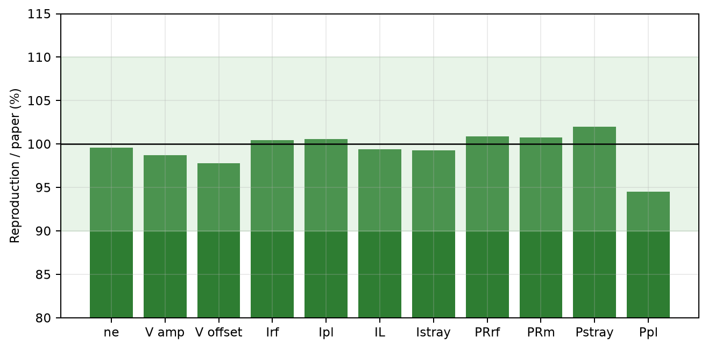
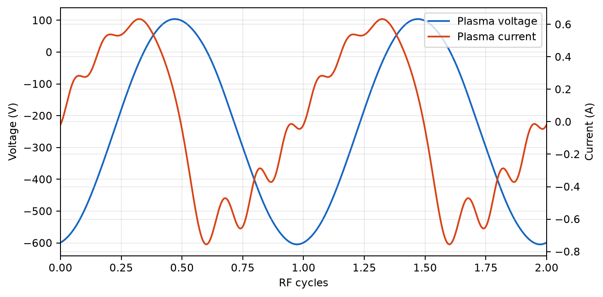
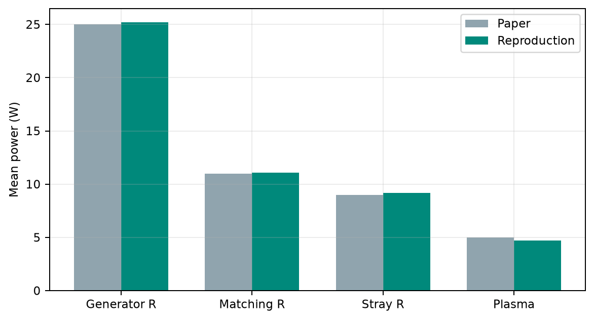
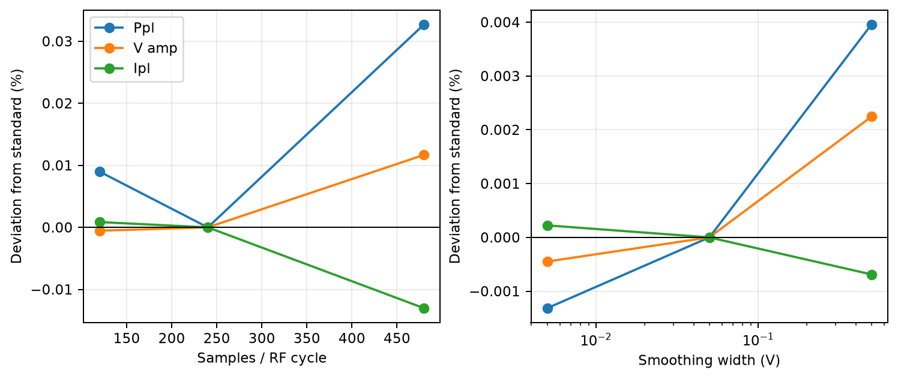

# Schmidt et al. (2018) 外部整合回路―Ar-CCP グローバルモデル再現レポート

作成日: 2026-09-02  
対象: F. Schmidt, T. Mussenbrock, J. Trieschmann, “Consistent simulation of capacitive radio-frequency discharges and external matching networks,” *Plasma Sources Science and Technology* 27, 105017 (2018), [DOI](https://doi.org/10.1088/1361-6595/aae429), [arXiv full text](https://arxiv.org/abs/1804.05638)

## 1. 結論

指定された `C:\Spice64\bin\ngspice_con.exe`（ngspice-46, KLU）を使い、論文の Ar 容量結合プラズマ、L 型整合回路、寄生枝、定常 0D グローバルモデルを連成した。公開標準点を再現できた。

- 電子温度は `4.7493 eV`、電子密度は `1.2452e15 m^-3` で、論文値との差はそれぞれ `-0.015%`、`-0.39%` だった。
- プラズマ電圧、4 枝の基本波電流、4 箇所の損失電力は、論文から読み取れる値に対してすべて `5.6%` 以内だった。
- 全系電力収支の正規化残差は `0.021%`、連続 RF 周期間の波形 L2 差は電圧 `1.84e-5`、電流 `1.19e-4` だった。
- `V_s=0` 近傍を滑らかに正則化し、電子電流を飽和電流以下へ制限した。平滑化幅を `0.005–0.5 V` と 100 倍変えても、主要量の変化は `0.004%` 以下だった。
- 論文は実際の SPICE netlist と非線形容量の実装規約を公開していない。公開された整合点を再現するには、論文式に対する実効微分容量係数 `alpha_C=0.5862` が必要だった。この係数は `Im(Z_in)` の一点だけで同定し、残りの電圧・電流・電力は独立な検証量とした。

したがって、標準問題の数値再現という目的は達成した。ただし `alpha_C` は著者コードを入手して確認した値ではなく、公開結果から同定した実装規約パラメータである。この点を隠さず、論文式直読ケースも感度結果に残した。

## 2. 再現対象

### 2.1 放電・電源条件

| 量 | 値 |
|---|---:|
| ガス | Ar |
| 圧力 | `0.66 Pa` |
| ガス温度 | `300 K` |
| 駆動電極面積 `A_E` | `100 cm^2` |
| 接地側面積 `A_G` | `300 cm^2` |
| バルク長 `l_B` | `5.7 cm` |
| 電源 | `100 V` peak, `13.56 MHz` cosine |
| 電源内部抵抗 | `50 ohm` |

### 2.2 外部回路

論文図 1 と損失電力の両方に整合するよう、次の順序で実装した。

```text
Vrf -- Rrf --+-- Cm1 -- ground
             |
             +-- Cm2 -- Lm2 -- Rm --+-- plasma -- ground
                                     |
                                     +-- Cstray -- Rstray -- ground
```

| 素子 | 値 | 位置 |
|---|---:|---|
| `C_m1` | `1550 pF` | 電源側ノードの並列容量 |
| `C_m2` | `175 pF` | 直列容量 |
| `L_m2` | `1500 nH` | 直列インダクタンス |
| `R_m` | `0.5 ohm` | 寄生枝との分岐前 |
| `C_stray` | `200 pF` | 寄生枝 |
| `R_stray` | `0.5 ohm` | 寄生枝 |

`R_m` を分岐後のプラズマ枝だけへ置くと、論文の `I_L≈6.7 A` に対応する約 `11 W` の損失を再現できない。分岐前へ置くことで、回路図、枝電流、損失電力が同時に一致した。

## 3. プラズマ・グローバルモデル

### 3.1 バルク等価回路

論文の一般化 Ohm 則

```text
d j/dt = (e^2 n / m_e) E - nu_eff j
```

を一様バルクへ積分し、直列 `L_p-R_p` とした。

```text
L_p = l_B m_e / (e^2 n A_E)
R_p = nu_eff L_p
nu_eff = n_g K_el + vbar_e / l_B
vbar_e = sqrt(8 e T_e / (pi m_e))
```

論文密度 `1.25e15 m^-3` と `T_e=4.75 eV` では、実装値は `L_p=161.82 nH`、`R_p=9.65 ohm` である。

### 3.2 シース

各シースは、非線形容量、Bohm イオン電流源、Maxwellian 電子電流源の並列回路である。

```text
I_i = A e n u_B
I_e = A e n vbar_e exp(-V_s / T_e)
C_s = sqrt(K / V_s),  K = 2 e n epsilon_0 A^2
```

シース電圧の符号は `V_s = V_bulk - V_electrode` とした。これにより論文の式 (2)–(4) と netlist の KCL が一致する。

### 3.3 粒子・電力収支

電子温度は粒子収支

```text
V_p n_g K_iz(T_e) = u_B(T_e) (A_E + A_G)
```

から一度だけ求める。密度は、各 ngspice 過渡計算で得たプラズマ吸収電力と平均シース電圧を論文式 (5) へ戻し、対数密度空間の緩和・挟み撃ちで反復した。

反応速度係数には、論文が参照する Gudmundsson の Ar 近似式を使用した。収束条件は、密度残差 `1e-3` 未満と RF 周期間 L2 差 `2e-4` 未満を、連続 3 反復で満たすこととした。

## 4. `V_s=0` 近傍の滑らかな正則化

### 4.1 電子電流

ユーザー指定どおり、負の `V_s` で指数関数が無制限に増大しないよう、滑らかな正部分

```text
Vplus_delta(V) = (V + sqrt(V^2 + delta_e^2)) / 2
```

を障壁へ使った。

```text
I_e,reg = I_e,sat exp(-Vplus_delta(V_s) / T_e)
```

この関数は有限で連続微分可能であり、全電圧に対して

```text
0 < I_e,reg <= I_e,sat
```

を保証する。ngspice 内では大きな負電圧での桁落ちを避けるため、同じ関数を代数的に有理化した分岐で評価する。`-1000–1000 V` の単体試験で有限性、単調性、上限を確認した。

### 4.2 シース容量

容量の発散には滑らかな絶対値

```text
Vabs_delta(V) = sqrt(V^2 + delta_C^2)
C_s,reg = alpha_C sqrt(K / Vabs_delta(V_s))
```

を使った。したがって `V_s=0` でも

```text
C_s,reg(0) = alpha_C sqrt(K / delta_C)
```

で有限である。標準値は `delta_e=delta_C=0.05 V` とした。

### 4.3 容量規約 `alpha_C`

論文の `C_s∝V_s^-1/2` は、`Q/V` と微分容量 `dQ/dV` の解釈で係数 2 の違いが生じうる。一方、論文には著者の netlist がない。現在の ngspice-46 では `C=expression` と `Q=expression` の双方を解析解へ当て、指定した微分容量を `0.02%` 以内で再現することを確認した。

そこで、公開された `n_e=1.25e15 m^-3`、`C_m1=1550 pF`、`C_m2=175 pF` を固定し、`Im(Z_in)=-0.02 ohm` を満たす一点から `alpha_C=0.5862` を同定した。他の公開量は同定に使用していない。

| `alpha_C` | `Z_in` (ohm) | `P_pl` (W) | `V_pl` 振幅 (V) | 解釈 |
|---:|---:|---:|---:|---|
| `0.5` | `32.32+j17.01` | `4.06` | `344.7` | `Q=C(V)V` の微分に相当 |
| `0.5862` | `49.67-j0.02` | `4.73` | `355.2` | 公開整合点から同定 |
| `1.0` | `1.44-j14.22` | `1.41` | `75.8` | 論文式を微分容量として直読 |

これは数値安定化幅とは別の問題である。`alpha_C=1` では別の低電圧・不整合周期解へ入り、論文図 3–5 を再現しない。

## 5. 再現結果



論文のグラフから読み取る量は有効桁が限定されるため、過度に細かな差は解釈しない。入力インピーダンスだけは本文記載値である。

| 量 | 論文 | 再現 | 差 |
|---|---:|---:|---:|
| `T_e` | `4.75 eV` | `4.7493 eV` | `-0.015%` |
| `n_e` | `1.25e15 m^-3` | `1.2452e15 m^-3` | `-0.39%` |
| `Z_in` | `50.01-j0.02 ohm` | `49.55+j0.40 ohm` | `Delta R=-0.46`, `Delta X=+0.42 ohm` |
| `V_pl` 振幅 | `約360 V` | `355.3 V` | `-1.30%` |
| `V_pl` DC オフセット | `約-250 V` | `-244.5 V` | 絶対値 `-2.19%` |
| `I_rf` 基本波振幅 | `約1.0 A` | `1.004 A` | `+0.45%` |
| `I_pl` 基本波振幅 | `約0.6 A` | `0.604 A` | `+0.60%` |
| `I_L` 基本波振幅 | `約6.7 A` | `6.659 A` | `-0.62%` |
| `I_stray` 基本波振幅 | `約6.1 A` | `6.055 A` | `-0.73%` |
| `R_rf` 損失 | `約25 W` | `25.22 W` | `+0.90%` |
| `R_m` 損失 | `約11 W` | `11.08 W` | `+0.77%` |
| `R_stray` 損失 | `約9 W` | `9.18 W` | `+1.99%` |
| プラズマ吸収電力 | `約5 W` | `4.72 W` | `-5.51%` |



電圧はほぼ正弦波で、電流には顕著な高調波が現れた。再現したプラズマ電流の 2 次高調波は `0.156 A` で、論文の約 `0.15 A` と一致する。電源電流の 2 次高調波は `1.90 mA` まで外部回路で抑制された。



## 6. 保存則・数値検証

### 6.1 解析回路と非線形容量

- 直列 RLC の ngspice 過渡解から基本波インピーダンスと平均抵抗損失を計算し、解析解との相対誤差 `0.1%` 未満を試験する。
- `C=sqrt(K/V)` と `Q=2sqrt(KV)` の二つの behavioral capacitor を既知の電圧ランプで駆動し、いずれも `I=C(V)dV/dt` の解析解へ `0.02%` 以内で一致することを試験する。
- 電子電流の正則化は `-1000–1000 V` で有限、正、単調非増加、飽和電流以下であることを試験する。

### 6.2 電力収支

標準点の平均電力は次のとおりである。

```text
電源が回路へ供給          50.2225 W
Rrf                       25.2239 W
Rm                        11.0843 W
Rstray                     9.1788 W
プラズマ                   4.7247 W
```

損失と吸収の和は `50.2117 W` で、正規化残差は `2.15e-4 = 0.0215%` だった。

### 6.3 時間刻み感度



最大刻みを RF 周期の `/120`、`/240`、`/480` とした。`/240` を基準にした変動は次のとおりである。

| 指標 | 3 水準の範囲 | `/240` からの最大相対変化 |
|---|---:|---:|
| `P_pl` | `4.7247–4.7262 W` | `0.033%` |
| `V_pl` 振幅 | `355.313–355.356 V` | `0.012%` |
| `I_pl` 基本波 | `0.603525–0.603609 A` | `0.013%` |
| `Re(Z_in)` | `49.36–49.58 ohm` | `0.39%` |

高 Q 整合点では小さな負荷リアクタンス差が入力側で拡大されるため、`Im(Z_in)` は `0.28–1.00 ohm` と相対的に敏感だった。プラズマ量・電力の刻み依存は合格基準 1% を十分下回る。

### 6.4 正則化幅感度

`delta_e=delta_C` を `0.005`、`0.05`、`0.5 V` と変えた。

| 指標 | 3 水準の範囲 | 最大差 |
|---|---:|---:|
| `P_pl` | `4.72462–4.72487 W` | `0.0053%` |
| `V_pl` 振幅 | `355.313–355.323 V` | `0.0027%` |
| `I_pl` 基本波 | `0.603600–0.603605 A` | `0.0009%` |

標準周期解のシース電圧は正則化幅より十分大きく、採用した平滑化が論文再現量を支配していない。

## 7. 再現手順

PowerShell でリポジトリ直下から実行する。

```powershell
uv sync
uv run pytest

uv run plasma-reproduce `
  --config configs/schmidt2018.json `
  --output artifacts/schmidt2018/reproduction_strict

uv run plasma-validate `
  --config configs/schmidt2018.json `
  --base-summary artifacts/schmidt2018/reproduction_strict/summary.json `
  --base-output artifacts/schmidt2018/reproduction_strict
```

各密度反復のディレクトリに、実行した `case.cir`、`ngspice.log`、`process.json`、`waveforms.dat` を保存する。検証集計は [schmidt2018_validation.json](data/schmidt2018_validation.json) に保存した。

## 8. 判定

| ゲート | 判定 | 根拠 |
|---|---|---|
| 解析 RLC | 合格 | インピーダンス・平均電力の誤差 `0.1%` 未満 |
| 非線形容量・電子電流 | 合格 | 解析解、有限性、上限、単調性の単体試験 |
| 粒子・エネルギー収支 | 合格 | `T_e` と `n_e` が論文値へ収束 |
| 2018 年標準問題 | 条件付き合格 | 主要公開量 `5.6%` 以内。ただし `alpha_C` を一点同定 |
| 時間刻み・正則化感度 | 合格 | プラズマ量・電力の変動 `0.04%` 未満 |
| 全系電力収支 | 合格 | 残差 `0.0215%` |

## 9. 限界と次の実験

1. `alpha_C` の由来を確定するには、著者の 2018 年版 netlist、当時の ngspice 版、または非線形容量コードが必要である。現時点では公開結果からの推定である。
2. このグローバルモデルは定常・体積平均であり、局所 EEDF、シース内分布、イオンエネルギー分布を直接予測しない。
3. 実機へ移す前に、プラズマ OFF で整合器、ケーブル、電極の寄生 `R/L/C` を VNA または既知負荷で同定する。
4. 実測では電極直近の RF 電圧・電流を同時測定し、プローブ時間差を 50 ohm ダミー負荷で校正する。比較量は基本波インピーダンス、`<vi>`、DC 自己バイアス、2–12 次高調波とする。
5. 装置固有の圧力・電力走査へ進む前に、`alpha_C` を固定したまま未使用条件を予測し、再調整なしで傾向が一致するか検証する。

詳細な装置実験計画、圧力・電力マップ、寄生成分の要因計画はリポジトリ直下の `研究計画.md` に記載した。

## 10. 参照

1. Schmidt et al., [arXiv full text](https://arxiv.org/html/1804.05638v1), とくに式 (1)–(6)、図 1、図 3–6。
2. ngspice project, [documentation](https://ngspice.sourceforge.io/docs.html) および [ngspice manual](https://ngspice.sourceforge.io/docs/ngspice-manual.pdf)。
